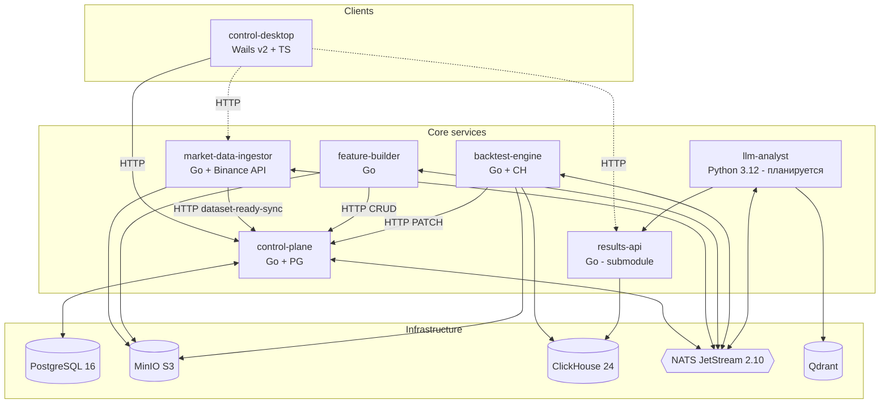
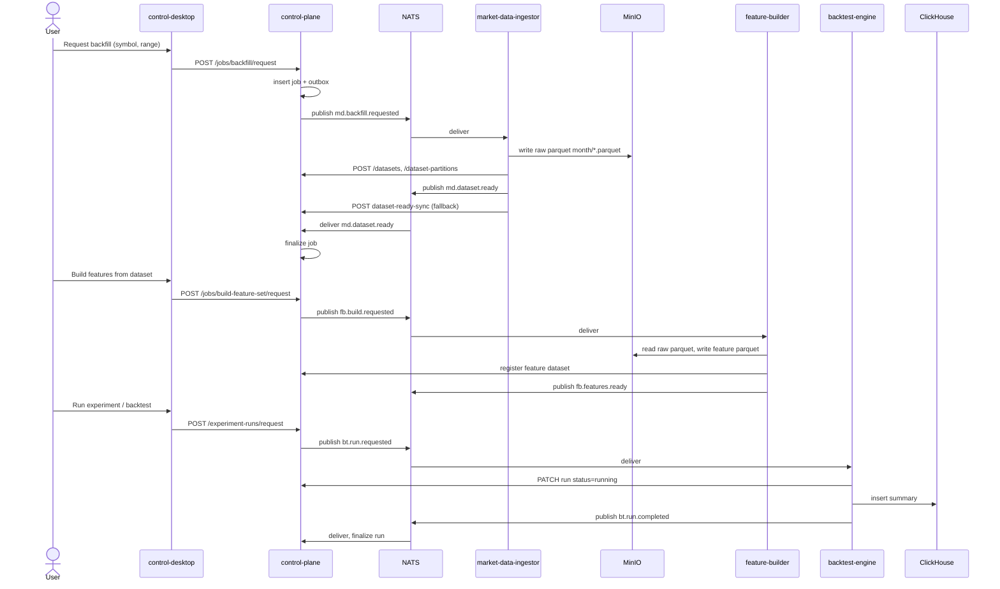
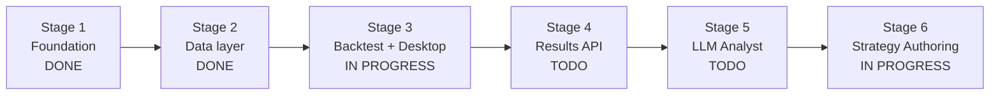

# Algorhythm — Project Specification

Единая точка входа в документацию платформы. Здесь — цель проекта, финальное видение, архитектура, реестр сервисов, roadmap, статус-дашборд и глоссарий. Подробная спека каждого этапа — в [docs/stages/](stages/).

---

## 1. Цель проекта и финальное видение

Algorhythm — платформа для **массового тестирования торговых гипотез** на исторических рыночных данных. См. полный регламент: [trading_platform_technical_charter.md](../trading_platform_technical_charter.md) §2.

Платформа должна уметь:

1. получать минутные свечи по списку инструментов за длинные исторические периоды;
2. хранить сырые данные в компактном и быстром для чтения формате;
3. строить производные наборы признаков и аналитические датасеты;
4. принимать декларативные модели стратегий, а не зашитую в коде бизнес-логику;
5. прогонять десятки миллионов сценариев бэктеста на едином расчётном ядре;
6. сохранять все результаты расчётов в аналитическое хранилище;
7. агрегировать результаты по месяцам, кварталам, годам, инструментам, режимам рынка, наборам параметров;
8. предоставлять единый API для чтения результатов;
9. подключать LLM к итоговым данным и семантическому слою для анализа закономерностей.

**Главный принцип:** стратегия описывается данными, а не переписыванием сервисов.

### Финальная картина E2E

```mermaid
flowchart LR
  user([Исследователь]) --> desktop[control-desktop]
  desktop -- HTTP --> cp[control-plane]
  desktop -. HTTP .-> results[results-api]

  cp -- md.backfill.requested --> mdi[market-data-ingestor]
  mdi -- Parquet --> minio[(MinIO)]
  mdi -- md.dataset.ready --> cp

  cp -- fb.build.requested --> fb[feature-builder]
  fb -- Parquet --> minio
  fb -- fb.features.ready --> cp

  cp -- bt.run.requested --> bt[backtest-engine]
  bt -- читает --> minio
  bt -- summaries + trades + equity --> ch[(ClickHouse)]
  bt -- bt.run.completed/failed --> cp

  results -- SELECT --> ch
  llm[llm-analyst] -- HTTP --> results
  llm -- vectors --> qdrant[(Qdrant)]
  llm -. llm.reindex.completed .-> cp
```

Конечное состояние: пользователь из `control-desktop` за один сценарий идёт «sync биржи → backfill raw → build features → submit experiment → распределённый прогон тысяч run'ов → агрегаты и leaderboard → LLM-инсайты» без единого запуска CLI.

---

## 2. Ключевые принципы

- **Hexagonal / Ports & Adapters** в каждом сервисе. Домен в центре, IO по краям.
- **No shared code** между сервисами. У каждого — свой `.env`, `Dockerfile`, `go.mod`, миграции. См. [ADR-001](architecture/adr-001-meta-repo-and-submodules.md).
- **Границы сервисов фиксированы.** Ни один сервис не пишет в чужую БД. См. [ADR-003](architecture/adr-003-service-boundaries.md).
- **Raw и feature данные — Parquet в S3/MinIO.** Метаданные — PostgreSQL (control-plane). Результаты — ClickHouse. Векторы — Qdrant. См. [ADR-002](architecture/adr-002-data-storage-model.md).
- **Стратегия — данные (DSL).** Только backtest-engine интерпретирует DSL. См. [ADR-004](architecture/adr-004-backtest-dsl.md).
- **Асинхронные команды — через outbox + NATS JetStream.** Идемпотентность джобов по `external_id`. См. [event-catalog.md](api/event-catalog.md).
- **Immutable raw snapshots** для воспроизводимости. Каждый snapshot имеет SHA-256 checksum по телу parquet и манифест партиций. См. [ADR-005](architecture/adr-005-futures-raw-data-model.md).
- **Минимальный HTTP у NATS-воркеров** — только `/healthz` и `/readyz`. См. [ADR: health http workers](architecture/adr-health-http-workers.md).

---

## 3. Архитектура платформы

### 3.1 Контекст (C4)



### 3.2 Потоки событий NATS JetStream

Единый стрим **`ORCHESTRATION`** с масками subjects: **`md.>`, `fb.>`, `bt.>`, `cp.>`, `llm.>`**.

Полный каталог субджектов — [docs/api/event-catalog.md](api/event-catalog.md). Все подписчики используют `DeliverNew` и версионированные durable-имена, чтобы не переигрывать старый backlog.

### 3.3 Канонический путь данных



---

## 4. Реестр сервисов

| Сервис | Submodule path | Роль | Стек | Связанные ADR | Состояние |
|---|---|---|---|---|---|
| [control-plane](../services/control-plane/) | `services/control-plane` | Реестры, джобы, outbox, orchestration | Go + PostgreSQL | [001](architecture/adr-001-meta-repo-and-submodules.md), [002](architecture/adr-002-data-storage-model.md), [003](architecture/adr-003-service-boundaries.md) | **Production-ready** для этапов 1–2, частично для этапа 3 (strategy/experiment domain есть, есть mismatch миграций — см. stage-3) |
| [market-data-ingestor](../services/market-data-ingestor/) | `services/market-data-ingestor` | Binance USDⓈ-M → Parquet в MinIO, snapshot-слой, валидация | Go + Binance REST | [002](architecture/adr-002-data-storage-model.md), [005](architecture/adr-005-futures-raw-data-model.md) | **Production-ready** |
| [feature-builder](../services/feature-builder/) | `services/feature-builder` | Feature parquet из raw | Go | [002](architecture/adr-002-data-storage-model.md), [003](architecture/adr-003-service-boundaries.md), [health-http](architecture/adr-health-http-workers.md) | **MVP ready** (1 feature set, 1m only) |
| [backtest-engine](../services/backtest-engine/) | `services/backtest-engine` | Интерпретатор DSL + запись результатов в CH | Go + ClickHouse | [002](architecture/adr-002-data-storage-model.md), [003](architecture/adr-003-service-boundaries.md), [004](architecture/adr-004-backtest-dsl.md), [health-http](architecture/adr-health-http-workers.md) | **Тонкий orchestration stub**; реальный DSL-runtime — TODO |
| [control-desktop](../services/control-desktop/) | `services/control-desktop` | Десктопный GUI-оркестратор | Wails v2 + Go + TypeScript | [003](architecture/adr-003-service-boundaries.md) | **Рабочее приложение** (Go + dist); исходники фронта в репо временно редуцированы (см. stage-3) |
| [results-api](../services/results-api/) | `services/results-api` | Read-only HTTP поверх CH | Go | [003](architecture/adr-003-service-boundaries.md) | **MVP + submodule** (отдельный репозиторий `Algorhythm-LLC/results-api`; полнота Stage 4 — впереди) |
| llm-analyst | `services/llm-analyst` (создать) | Embeddings + Qdrant + retrieval | Python 3.12 | [003](architecture/adr-003-service-boundaries.md) | **TODO** (этап 5) |

Инфраструктура: `ops/full-stack/` — `docker-compose.yml` поднимает MinIO, PostgreSQL 16, ClickHouse 24, NATS 2.10 (JetStream), Qdrant. Остаётся в корне мета-репо.

---

## 5. Roadmap

| Этап | Название | Состояние | Ссылка |
|---|---|---|---|
| 1 | Foundation | **DONE** | [stage-1-foundation.md](stages/stage-1-foundation.md) |
| 2 | Data layer — raw + features + orchestration + snapshots | **DONE** | [stage-2-data-layer.md](stages/stage-2-data-layer.md) |
| 3 | Backtest engine + Control Desktop | **IN PROGRESS** | [stage-3-backtest-and-desktop.md](stages/stage-3-backtest-and-desktop.md) |
| 4 | Results API и витрина | **TODO** | [stage-4-results-api.md](stages/stage-4-results-api.md) |
| 5 | LLM Analyst | **TODO** | [stage-5-llm-analyst.md](stages/stage-5-llm-analyst.md) |
| 6 | Strategy Authoring | **IN PROGRESS** | [stage-6-strategy-authoring.md](stages/stage-6-strategy-authoring.md) |



---

## 6. Статус-дашборд

### Stage 1 — Foundation — DONE

Закрытый этап. Meta-repo, submodules, вся инфраструктура поднимается одной командой, скелеты `control-plane` и `market-data-ingestor` работают. Подробности: [stage-1-foundation.md](stages/stage-1-foundation.md).

### Stage 2 — Data layer — DONE

Главные достижения:
- Полный Binance USDⓈ-M adapter (exchangeInfo, klines, markPriceKlines, fundingRate) с rate limiter 1200 req/min.
- Полный backfill trade_klines / mark_price_klines / funding_rates 1m с monthly-partition-дизайном и штатным overlap на границах месяцев.
- Immutable snapshot-слой с SHA-256 checksum партиций и manifest-ом.
- Deep validation с 20+ кодами issue'ов (schema, bounds, checksum, manifest, continuity, alignment).
- control-plane orchestration v1: outbox + JetStream stream `ORCHESTRATION`, worker публикует команды (`md.backfill.requested`, `fb.build.requested`, `bt.run.requested`), consumer'ы обновляют реестр.
- feature-builder MVP: feature set `btcusdt_futures_mvp` v1 с returns/EMA/ATR/RSI/volatility/funding/regime.
- Подтверждение на проде: backfill SOLUSDT 2026‑01‑19..04‑19 — 129 600 уникальных минут, 0 пропусков, все 3 межмесячных «дубля» — штатный by-design overlap.

Остающиеся необязательные пункты (операционная нагрузка, не блокирует этап 3): массовая заливка 3 лет по разным символам; полный e2e-скрипт на стенде для всех слоёв; схема автомигрирования при изменениях схемы parquet.

Подробности: [stage-2-data-layer.md](stages/stage-2-data-layer.md).

### Stage 3 — Backtest + Desktop — IN PROGRESS

Текущий фокус. Состояние реализации:

**Уже есть:**
- control-plane: таблицы `strategy_templates`, `strategy_versions`, `experiment_batches`, `experiment_runs` + HTTP API (POST/GET) + обработка `bt.run.completed` / `bt.run.failed` через worker.
- backtest-engine: MVP-stub — consumer `bt.run.requested`, PATCH run → `running`, INSERT одной строки в CH `backtest_run_summaries`, publish `bt.run.completed`/`failed`.
- control-desktop: Go backend + ~30 Wails-bound методов + полноценный dist frontend с хеш-роутером и экранами overview/jobs/datasets/backfill/features/validation/health/experiments/processes/backup/settings. Локальный archive/backup работает через NATS subscribe и S3/PG/CH подключения.

**Что осталось (главное):**
- Полноценная JSON Schema DSL v1 + валидация в control-plane на публикации версии.
- Реальный DSL-интерпретатор в backtest-engine: bar-iteration, indicators runtime, order/fill-модель, slippage, PnL, equity curve.
- Расширенная модель результатов в ClickHouse: `backtest_trades`, `backtest_equity_curve`, `backtest_metrics` + партиционирование + retention.
- Backtest-engine: чтение feature parquet из MinIO, детерминизм (seeded rng, стабильный порядок итерации).
- backtest-engine: PATCH run в терминальные статусы (`completed`/`failed`) с `result`.
- control-plane: устранение mismatch между embedded миграциями (`000001_init.up.sql` со столбцами вроде `model_json`) и Go-кодом в `internal/adapters/postgres/strategy_experiment.go` (ожидает `dsl_json` и т.д.).
- control-desktop: восстановить/пересобрать `frontend/src/*.ts` (screens, lib, ui) в соответствии с README — сейчас в репо только стили, работающий SPA лежит только в `dist/`.

Подробности и DoD: [stage-3-backtest-and-desktop.md](stages/stage-3-backtest-and-desktop.md).

### Stage 4 — Results API — TODO (сервис заведён, зрелость — впереди)

Сервис **`results-api`** вынесен в **отдельный репозиторий** и подключён в meta как **submodule** `services/results-api` → `https://github.com/Algorhythm-LLC/results-api.git`. Уже есть read-only HTTP над ClickHouse (summary / trades / equity / compare). Для «закрытия» этапа 4 по изначальной спеке остаётся hardening: агрегаты по experiment, leaderboard, auth/rate-limit и т.д. Зависимость — стабильные таблицы результатов из этапа 3. Подробности: [stage-4-results-api.md](stages/stage-4-results-api.md), миграция: [stage-6-1-results-api-submodule.md](stages/stage-6-1-results-api-submodule.md).

### Stage 5 — LLM Analyst — TODO

Новый сервис `llm-analyst` (submodule `services/llm-analyst`), Python 3.12. Embeddings поверх results-api, Qdrant, consumer `llm.reindex.requested` / publisher `llm.reindex.completed`. Подробности: [stage-5-llm-analyst.md](stages/stage-5-llm-analyst.md).

### Stage 6 — Strategy Authoring — IN PROGRESS

Продуктовый слой над DSL/runtime уже получил первый MVP vertical slice: `draft -> preflight -> publish -> run -> compare` собран end-to-end через `control-plane`, `backtest-engine`, `control-desktop` и **`results-api`** (submodule). При этом full product maturity ещё не достигнута: монолитный strategy screen, **зрелость read-side / Stage 4** и ограниченный runtime-supported subset остаются следующими задачами. Подробности: [stage-6-strategy-authoring.md](stages/stage-6-strategy-authoring.md).

---

## 7. Структура репозитория

```
Algorhythm/
  README.md                       # быстрый старт, команды запуска
  trading_platform_technical_charter.md  # обязательный регламент (923 строки)
  docs/
    project-spec.md               # этот файл — хаб
    README.md                     # карта документации
    stages/                       # подробная спека по этапам
      stage-1-foundation.md
      stage-2-data-layer.md
      stage-3-backtest-and-desktop.md
      stage-4-results-api.md
      stage-5-llm-analyst.md
      stage-6-strategy-authoring.md
    architecture/                 # ADR
      technical-charter.md        # краткий зеркальный файл
      adr-001-meta-repo-and-submodules.md
      adr-002-data-storage-model.md
      adr-003-service-boundaries.md
      adr-004-backtest-dsl.md
      adr-005-futures-raw-data-model.md
      adr-health-http-workers.md
    api/
      event-catalog.md            # NATS subjects
      integration-map.md          # карта интеграций
    powershell-tips.md
  ops/full-stack/                 # docker-compose вся инфра
  scripts/                        # start/stop/reset/smoke скрипты
  services/                       # submodules
    control-plane/
    market-data-ingestor/
    feature-builder/
    backtest-engine/
    control-desktop/
```

---

## 8. Глоссарий

| Термин | Определение |
|---|---|
| **Raw dataset** | Parquet с «сырыми» свечами/фандингом в MinIO под каноническим префиксом `raw/<kind>/...`. Источник истины. |
| **Feature dataset** | Parquet с производными признаками поверх raw. Путь: `features/feature_set=.../...`. |
| **Partition** | Месячная папка `year=YYYY/month=MM/data.parquet`. Один файл на месяц. |
| **Snapshot** | Immutable копия raw с манифестом (row_count, min/max ts, SHA-256 checksum каждой партиции). Путь: `raw-snapshots/.../snapshot=<uuid>/...`. |
| **Strategy template** | Именованная стратегия (code) в `control-plane`. |
| **Strategy version** | Immutable версия DSL-документа конкретного template'а. |
| **DSL** | JSON-документ стратегии: `instrument_scope`, `entry`, `exit`, `filters`, `risk`, `execution`. Только `backtest-engine` интерпретирует. |
| **Experiment batch** | Группа прогонов одной strategy version по разным параметрам/инструментам/периодам. |
| **Run** | Одиночный backtest прогон: `strategy_version_id` + параметры + feature dataset + диапазон. |
| **Service job** | Идемпотентная запись в `service_jobs` (CP): команды backfill / build / validate. Статусы: `created → queued → running → succeeded/failed`. |
| **Outbox** | Таблица `event_outbox` в PG: CP worker вынимает pending-события и публикует в NATS транзакционно с переводом job/run в `queued`. |
| **ORCHESTRATION** | Единое имя JetStream stream'а; маски `md.>`, `fb.>`, `bt.>`, `cp.>`, `llm.>`. |
| **Canonical prefix / Snapshot prefix** | Канонический путь raw vs путь снапшота — см. ADR-005. |
| **Overlap на границе месяца** | Первая минута следующего месяца (напр., `2026-02-01 00:00`) пишется и в файл предыдущего, и следующего месяца. Штатная гарантия закрытой границы, см. stage-2. |

---

## 9. Ссылки

- [README.md](../README.md) — быстрый старт, команды запуска.
- [trading_platform_technical_charter.md](../trading_platform_technical_charter.md) — полный регламент (мотивация многих решений).
- [docs/architecture/](architecture/) — все ADR.
- [docs/api/event-catalog.md](api/event-catalog.md) — NATS subjects.
- [docs/api/integration-map.md](api/integration-map.md) — матрица интеграций.
- Stage-файлы: [1](stages/stage-1-foundation.md), [2](stages/stage-2-data-layer.md), [3](stages/stage-3-backtest-and-desktop.md), [4](stages/stage-4-results-api.md), [5](stages/stage-5-llm-analyst.md), [6](stages/stage-6-strategy-authoring.md).
