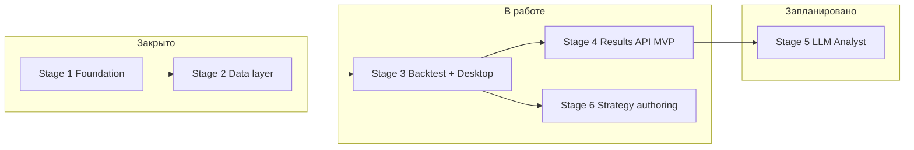
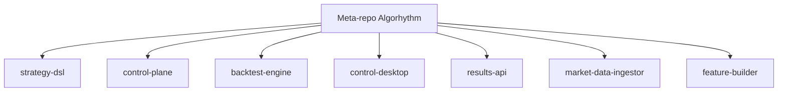

# Algorhythm — статус проекта (обзор)

**Формат:** таблицы и текст — всегда видны. Диаграммы — в блоках **Mermaid** (на [GitHub](https://github.com/Algorhythm-LLC/Algorhythm/blob/dev/docs/project-status.md) они превращаются в картинки). Если в редакторе блоки `mermaid` выглядят «пустыми», ниже для каждой схемы есть **ASCII-копия**, которая отображается без рендерера.

**Снимок:** 2026-04-22 (PR-09 shipped; strategy-dsl v0.1.4 released) · **Meta-repo:** [Algorhythm-LLC/Algorhythm](https://github.com/Algorhythm-LLC/Algorhythm) · ветка разработки: `dev`

Возврат к [project-spec.md](project-spec.md).

---

## Этапы (roadmap)

**ASCII (всегда видно в любом просмотрщике):**

```
Закрыто          В работе                         Запланировано
────────         ─────────────────────────────    ─────────────
Stage 1 DONE ──► Stage 3 IN PROGRESS ──┬──► Stage 5 TODO
Stage 2 DONE ──► Stage 4 IN PROGRESS ──┼──► (после 4)
                  Stage 6 IN PROGRESS ─┘
Связь этапов: 1→2→3→4; от 3 параллельно идёт 6; после 4 — 5.
```

**Mermaid (рендер на GitHub / с плагином Mermaid):**



| Этап | Название | Статус |
|------|-----------|--------|
| 1 | Foundation | **DONE** |
| 2 | Data layer | **DONE** |
| 3 | Backtest + Desktop | **IN PROGRESS** (RunV1, CH, optional MinIO, preflight) |
| 4 | Results API | **IN PROGRESS** (submodule, read над CH; агрегаты/auth — дальше) |
| 5 | LLM Analyst | **TODO** |
| 6 | Strategy authoring | **IN PROGRESS** (draft → preflight → publish → run → compare) |

---

## Сабмодули и роли

**ASCII (дерево meta-repo):**

```
Algorhythm (meta)
├── modules/strategy-dsl
├── services/control-plane
├── services/backtest-engine
├── services/control-desktop
├── services/results-api
├── services/market-data-ingestor
└── services/feature-builder
```

**Mermaid:**



| Путь в meta | Репозиторий (org) | Роль |
|-------------|-------------------|------|
| `modules/strategy-dsl` | Algorhythm-LLC/strategy-dsl | JSON Schema v1/v2, dispatch |
| `services/control-plane` | algorhythm-control-plane | API, worker, PG, authoring, NATS |
| `services/backtest-engine` | algorhythm-backtest-engine | dslcompile, RunV1, CH, preflight HTTP |
| `services/control-desktop` | algorhythm-control-desktop | Wails + TS SPA |
| `services/results-api` | results-api | Read-only HTTP над ClickHouse |
| `services/market-data-ingestor` | algorhythm-market-data-ingestor | Raw Binance → MinIO |
| `services/feature-builder` | algorhythm-feature-builder | Feature parquet |

Клонирование: `git submodule sync --recursive` и `git submodule update --init --recursive`. **Module path:** `github.com/algorhythm-llc/...` (нижний регистр). **Clone URL:** `https://github.com/Algorhythm-LLC/<repo>.git`.

---

## Закрытые milestone (Stage 6.1)

| ID | Тема | Документ |
|----|------|-----------|
| PR-07 | Close-side / dual entry | [stage-6-1-pr-07-independent-close-side-runtime.md](stages/stage-6-1-pr-07-independent-close-side-runtime.md) |
| PR-08 | `signal_only` | [stage-6-1-pr-08-signal-only.md](stages/stage-6-1-pr-08-signal-only.md) |
| PR-09 | `continuous` / `flip` (reentry_mode) | [stage-6-1-pr-09-continuous-flip.md](stages/stage-6-1-pr-09-continuous-flip.md) |
| — | strategy-dsl | **v0.1.4** (released; `replace` снят в CP и engine) |

**Следующий semantic slice не выбран.** Кандидаты: `reverse_on_close`, явный `allow_reentry` / `cooldown`, или DSL v2 executor. Текущий фокус — canonical E2E на стенде с новым DSL.

---

## CI и E2E

| Что | Где |
|-----|-----|
| `go test` по ключевым модулям | Meta: `.github/workflows/go-smoke.yml` (push/PR `main`, `dev`) |
| CI сервиса results-api | Submodule: `services/results-api/.github/workflows/` |
| Канонический вертикальный сценарий Stage 6.1 | [stage-6-1-canonical-e2e.md](stages/stage-6-1-canonical-e2e.md), скрипт `scripts/stage-6-1-canonical-e2e.ps1` (нужен живой стек + UUID feature set) |

---

## Следующие шаги (кратко)

1. Прогнать **canonical E2E** на стенде с `-FeatureSetVersionId` **и** DSL, где `execution.reentry_mode` ≠ `single`.
2. Зрелость **Stage 4** (results-api): агрегаты, auth, rate-limit по спеке.
3. Выбрать следующий semantic slice осознанно (`reverse_on_close` / `allow_reentry` / v2 executor).

---

## Как обновлять этот файл

При смене этапа, сабмодуля или milestone:

1. Обновите **дату снимка** в шапке и при необходимости таблицы / Mermaid.
2. Сверьте детали с [project-spec.md](project-spec.md) и [stage-6-1-prioritized-backlog.md](stages/stage-6-1-prioritized-backlog.md).
3. Закоммитьте изменения в **meta-repo** вместе с остальной документацией.

Источник правды по продукту — **Git и stage-доки**; этот файл — компактная **витрина** для людей и для предпросмотра с диаграммами.

---

## См. также

- [handoff-chatgpt-project-state.md](handoff-chatgpt-project-state.md) — контекст для внешних моделей  
- [stage-6-runtime-support-matrix.md](stages/stage-6-runtime-support-matrix.md) — supported vs planned runtime  
- [api/event-catalog.md](api/event-catalog.md) — NATS subjects  
