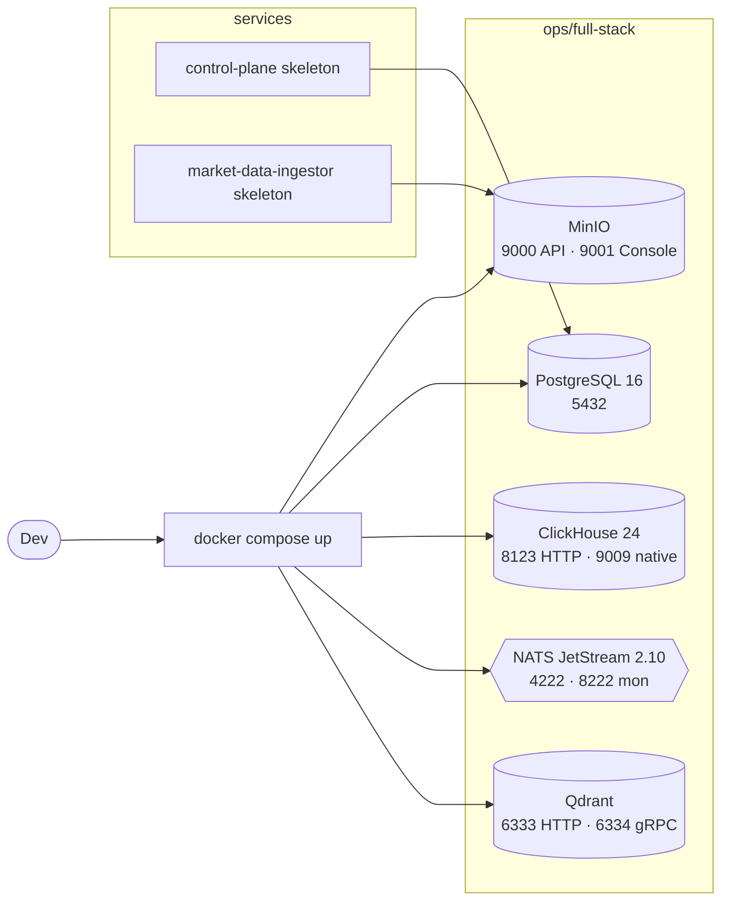

# Stage 1 — Foundation

**Статус:** DONE. Этап закрыт и заморожен — дальнейшие изменения идут через точечные PR, а не как часть этапа.

Возврат к [project-spec.md](../project-spec.md).

---

## Цель этапа

Заложить физический фундамент платформы:

1. единый мета-репозиторий с правилом «один сервис — один submodule»;
2. локально-воспроизводимая инфраструктура (object storage, RDBMS, OLAP, message broker, vector DB);
3. скелеты двух первых сервисов (`control-plane` и `market-data-ingestor`), на которые строятся этапы 2 и 3.

---

## Scope

- Мета-репозиторий Algorhythm с `.gitmodules`.
- `ops/full-stack/docker-compose.yml` со всеми обязательными сервисами хранения и транспорта.
- Скелеты `control-plane` и `market-data-ingestor` под `services/`.
- Первичные миграции PostgreSQL control-plane.

### Out of scope

- Собственно backfill данных (этап 2).
- Feature-builder, backtest-engine, desktop (этапы 2–3).
- CI/CD, релизные артефакты (поступают в рабочий режим позже).

---

## Архитектура

Обоснование выбора — [ADR-001](../architecture/adr-001-meta-repo-and-submodules.md) и [ADR-002](../architecture/adr-002-data-storage-model.md).

---

## Реализация (DONE)

### Meta-repo и submodules

- Корневой репозиторий содержит `.gitmodules`, `docs/`, `ops/full-stack/`, `scripts/`, `trading_platform_technical_charter.md`.
- Каждый сервис живёт под `services/<name>` как Git submodule со своим жизненным циклом. Решение зафиксировано в [ADR-001](../architecture/adr-001-meta-repo-and-submodules.md).
- Скрипт инициализации: [`scripts/bootstrap-submodules.sh`](../../scripts/bootstrap-submodules.sh).

### Инфраструктура (`ops/full-stack/`)

- Конфиг: [`ops/full-stack/docker-compose.yml`](../../ops/full-stack/docker-compose.yml).
- Сервисы в одной bridge-сети `algorhythm`:
  - **MinIO** — `9000` (API), `9001` (console); volume `minio_data`.
  - **PostgreSQL 16** — `5432`; volume `postgres_data`.
  - **ClickHouse 24** — `8123` (HTTP), `9009:9000` (native); volume `clickhouse_data`.
  - **NATS 2.10** с JetStream (`-js`), монитором (`-m 8222`) — `4222`, `8222`; volume `nats_data`.
  - **Qdrant** — `6333` (HTTP), `6334` (gRPC); volume `qdrant_data`.
- Поднятие одной командой через PowerShell / sh обёртки: [`scripts/up-full-stack.ps1`](../../scripts/up-full-stack.ps1), [`scripts/up-full-stack.sh`](../../scripts/up-full-stack.sh).

### Скелеты сервисов

- **control-plane**: [`services/control-plane`](../../services/control-plane) — `cmd/api`, `cmd/worker`, `internal/{domain,ports,adapters,app}`, `migrations/`. Hexagonal-структура соответствует техуставу §11.1.
- **market-data-ingestor**: [`services/market-data-ingestor`](../../services/market-data-ingestor) — аналогичная структура с адаптерами `binance_usdm`, `s3`, `parquet`, `controlplane`.

### Начальные миграции PostgreSQL

- [`services/control-plane/migrations/000001_init.up.sql`](../../services/control-plane/migrations/000001_init.up.sql) создаёт базовые таблицы: `exchanges`, `instruments`, `datasets`, `dataset_partitions`, `feature_sets`, `feature_set_versions`, `strategy_templates`, `strategy_versions`, `experiment_batches`, `experiment_runs`, `service_jobs`, `event_outbox`.
- Миграции подключаются через `golang-migrate` и embed-ятся в бинарь worker'а: [`services/control-plane/migrations/embed.go`](../../services/control-plane/migrations/embed.go).

---

## Критерии завершения (DoD)

| Пункт | Статус |
|---|---|
| Мета-репо создан, `.gitmodules` содержит control-plane и market-data-ingestor | DONE |
| `docker compose up -d` в `ops/full-stack` поднимает все 5 сервисов и они healthcheck'аются | DONE |
| Скелет control-plane компилируется и запускается, `/healthz` отвечает 200 | DONE |
| Скелет market-data-ingestor компилируется и запускается, `/healthz` отвечает 200 | DONE |
| Первичные миграции PostgreSQL применяются без ошибок | DONE |

---

## Ссылки

- [ADR-001: Meta-repo и submodules](../architecture/adr-001-meta-repo-and-submodules.md)
- [ADR-002: Модель хранения данных](../architecture/adr-002-data-storage-model.md)
- [ADR-003: Границы сервисов](../architecture/adr-003-service-boundaries.md)
- [Технический устав §3, §5, §6](../../trading_platform_technical_charter.md)
- [docker-compose.yml](../../ops/full-stack/docker-compose.yml)
- [scripts/up-full-stack.ps1](../../scripts/up-full-stack.ps1), [up-full-stack.sh](../../scripts/up-full-stack.sh)
