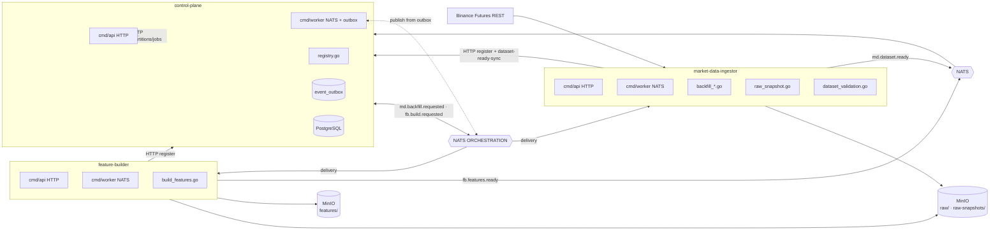

# Stage 2 — Data Layer

**Статус:** DONE. Ядро этапа закрыто, подтверждено production-backfill'ом SOLUSDT 2026‑01‑19..04‑19 (129 600 уникальных минут, 0 пропусков). Остающиеся пункты — операционные и не блокируют этап 3.

Возврат к [project-spec.md](../project-spec.md).

---

## Цель этапа

1. Собрать полный raw-слой Binance USDⓈ-M perpetual (trade klines, mark price klines, funding rates) с гарантиями целостности, идемпотентности и immutable snapshot'ов.
2. Построить первый feature-слой (MVP) поверх raw.
3. Развернуть orchestration v1 (outbox + NATS JetStream) для асинхронных команд и событий готовности между `control-plane`, `market-data-ingestor`, `feature-builder`.

---

## Scope

**В рамках:**

- Binance USDⓈ-M perpetual (фьючерсы). Нативный Futures REST API.
- Три типа raw датасетов: `trade_klines` (1m), `mark_price_klines` (1m), `funding_rates`.
- Monthly-partition layout `.../year=YYYY/month=MM/data.parquet` для всех слоёв.
- Deep validation с 20+ issue-кодами и SHA-256 checksum'ами снапшотов.
- Feature set `btcusdt_futures_mvp` v1 (только `1m`).
- Контур оркестрации: `md.backfill.requested → md.dataset.ready`, `fb.build.requested → fb.features.ready`; единый stream `ORCHESTRATION` с префиксами `md.>`, `fb.>`, `bt.>`, `cp.>`.
- HTTP API синхронного триггера операций на обоих сервисах.

**Out of scope:**

- Open interest history (Binance хранит только 1 месяц — не базовый слой).
- Continuous contract klines (не нужен для BTCUSDT/SOLUSDT perp).
- CCXT и не-Binance биржи (зафиксировано в [ADR-005](../architecture/adr-005-futures-raw-data-model.md)).
- Spot klines, minute-tick data.

---

## Архитектура



Обоснование данных и модели: [ADR-002](../architecture/adr-002-data-storage-model.md), [ADR-005](../architecture/adr-005-futures-raw-data-model.md).
Обоснование health у NATS-воркеров: [ADR: health-http-workers](../architecture/adr-health-http-workers.md) (feature-builder).

---

## Сущности и контракты

### PostgreSQL (control-plane)

| Таблица | Назначение | Миграция |
|---|---|---|
| `exchanges` | `binance_usdm` и пр. | [000001_init.up.sql](../../services/control-plane/migrations/000001_init.up.sql) |
| `instruments` | Инструменты с metadata из `exchangeInfo` | + [000002_futures_registry.up.sql](../../services/control-plane/migrations/000002_futures_registry.up.sql) |
| `datasets` | Raw и feature датасеты, `status`, `s3_prefix`, `metadata` | 000001, 000002, 000005 (metadata) |
| `dataset_partitions` | Месячные партиции с `year`, `month`, `s3_path`, `row_count`, `min_ts`, `max_ts`, `checksum` | 000001 |
| `feature_sets`, `feature_set_versions` | Реестр фич | 000001 |
| `service_jobs` | Идемпотентные команды по `external_id` | 000001, 000002 (result/idempotency) |
| `event_outbox` | Outbox событий CP | 000001, 000003 (payload/status), 000004 (aggregate\_\*, payload\_json) |

### S3/MinIO layout

```
s3://market-data/
  raw/
    trade_klines/exchange=binance_usdm/symbol=SYM/interval=1m/year=YYYY/month=MM/data.parquet
    mark_price_klines/.../year=YYYY/month=MM/data.parquet
    funding_rates/exchange=binance_usdm/symbol=SYM/year=YYYY/month=MM/data.parquet

  raw-snapshots/
    <kind>/.../snapshot=<uuid>/year=YYYY/month=MM/data.parquet

  features/
    feature_set=btcusdt_futures_mvp/exchange=.../symbol=.../interval=1m/year=YYYY/month=MM/data.parquet
```

### Parquet schemas

Все времена хранятся как `Int64` (epoch milliseconds, UTC).

**Trade klines** — [parquet/trade_klines.go](../../services/market-data-ingestor/internal/adapters/parquet/trade_klines.go):
`exchange, symbol, interval, open_time_utc, close_time_utc, open_i64, high_i64, low_i64, close_i64, volume_i64, quote_volume_i64, trades_count, taker_buy_base_volume_i64, taker_buy_quote_volume_i64, price_scale, volume_scale, source, ingested_at_utc`.

**Mark price klines** — [parquet/mark_price_klines.go](../../services/market-data-ingestor/internal/adapters/parquet/mark_price_klines.go):
`exchange, symbol, interval, open_time_utc, close_time_utc, open_mark_i64, high_mark_i64, low_mark_i64, close_mark_i64, price_scale, source, ingested_at_utc`.

**Funding rates** — [parquet/funding_rates.go](../../services/market-data-ingestor/internal/adapters/parquet/funding_rates.go):
`exchange, symbol, funding_time_utc, funding_rate_i64, funding_rate_scale, mark_price_i64, price_scale, source, ingested_at_utc`.

---

## API и события

### control-plane HTTP — [handlers.go](../../services/control-plane/internal/adapters/http/handlers.go)

| Метод | Путь | Назначение | Статус |
|---|---|---|---|
| POST | `/api/v1/exchanges/sync` | Зарегистрировать биржу | DONE |
| POST | `/api/v1/instruments/upsert` | Выгрузка inst metadata | DONE |
| GET/POST | `/api/v1/datasets` · `/datasets/{id}` | Реестр датасетов | DONE |
| PATCH | `/api/v1/datasets/{id}/metadata-merge` | Частичное обновление metadata | DONE |
| GET/POST | `/api/v1/datasets/{id}/partitions` · `/dataset-partitions` | Партиции | DONE |
| POST | `/api/v1/feature-sets` · `/feature-set-versions` | Реестр feature sets | DONE |
| GET/POST | `/api/v1/jobs`, `/jobs/{id}`, `/jobs/backfill/request`, `/jobs/build-feature-set/request` | Триггер команд | DONE |
| PATCH | `/api/v1/jobs/{id}/status`, `/jobs/{id}/result-merge` | Обновление статуса | DONE |
| POST | `/api/v1/jobs/{id}/dataset-ready-sync` | Фолбек-синхронизация результата backfill (используется MDI) | DONE |
| GET | `/healthz`, `/readyz`, `/api/v1/health/summary` | Probes | DONE |

### market-data-ingestor HTTP — [cmd/api/main.go](../../services/market-data-ingestor/cmd/api/main.go)

| Метод | Путь | Назначение | Статус |
|---|---|---|---|
| POST | `/api/v1/jobs/sync-exchange-info` | Синхронная синхронизация instruments | DONE |
| POST | `/api/v1/jobs/backfill/trade-klines` | Smoke-backfill trade | DONE |
| POST | `/api/v1/jobs/backfill/mark-price-klines` | Smoke-backfill mark | DONE |
| POST | `/api/v1/jobs/backfill/funding-rates` | Smoke-backfill funding | DONE |
| POST | `/api/v1/jobs/validate-dataset` | Deep validation по `dataset_id` | DONE |
| GET | `/api/v1/datasets/{dataset_id}` | Детали датасета (альтернатива CP) | DONE |
| — | `/healthz`, `/readyz` | Probes | DONE |

### feature-builder HTTP — [cmd/api/main.go](../../services/feature-builder/cmd/api/main.go)

| Метод | Путь | Назначение | Статус |
|---|---|---|---|
| POST | `/api/v1/jobs/build-feature-set` | Сборка произвольного feature set | DONE |
| POST | `/api/v1/jobs/build-feature-set/btcusdt-futures-mvp` | Ярлык на MVP | DONE |
| — | `/healthz`, `/readyz` | Probes | DONE |

### NATS subjects (этап 2)

| Subject | Producer | Consumer | Статус |
|---|---|---|---|
| `md.backfill.requested` | control-plane worker (из `event_outbox`) | market-data-ingestor worker (durable `market-data-ingestor-backfill-requested-v2`) | DONE |
| `md.dataset.ready` | market-data-ingestor (core JS publish + HTTP fallback `dataset-ready-sync`) | control-plane worker (durable `control-plane-md-dataset-ready-v2`) | DONE |
| `fb.build.requested` | control-plane worker (из outbox) | feature-builder worker (durable `feature-builder-build-requested-v2`) | DONE |
| `fb.features.ready` | feature-builder worker | control-plane worker (durable `control-plane-fb-features-ready-v2`) | DONE |

Стрим `ORCHESTRATION`, маски `md.>`, `fb.>`, `bt.>`, `cp.>`, `DeliverNew`, `ManualAck`, версионированные durable-имена. Полный каталог: [docs/api/event-catalog.md](../api/event-catalog.md).

---

## Реализация

### Binance USDⓈ-M adapter — DONE

Файлы: [binance_usdm/client.go](../../services/market-data-ingestor/internal/adapters/binance_usdm/client.go), [exchange_info.go](../../services/market-data-ingestor/internal/adapters/binance_usdm/exchange_info.go), [klines.go](../../services/market-data-ingestor/internal/adapters/binance_usdm/klines.go), [mark_price.go](../../services/market-data-ingestor/internal/adapters/binance_usdm/mark_price.go), [funding.go](../../services/market-data-ingestor/internal/adapters/binance_usdm/funding.go), [adapter.go](../../services/market-data-ingestor/internal/adapters/binance_usdm/adapter.go).

- Base URL `https://fapi.binance.com`.
- Покрыты: `GET /fapi/v1/exchangeInfo`, `GET /fapi/v1/klines` (limit 1500), `GET /fapi/v1/markPriceKlines` (limit 1500), `GET /fapi/v1/fundingRate` (limit 1000).
- **Rate limiter** — token bucket, 1200 req/min (запас к Binance лимиту 2400). Wait перед каждым GET.
- **429**: `domain.RateLimitError` с `Retry-After` (default 60s), retry до 3 раз.
- **Другие сетевые ошибки**: экспоненциальный backoff.

### Backfill pipeline — DONE

- [backfill.go](../../services/market-data-ingestor/internal/app/backfill.go) — trade klines.
- [backfill_mark_price.go](../../services/market-data-ingestor/internal/app/backfill_mark_price.go) — mark price.
- [backfill_funding.go](../../services/market-data-ingestor/internal/app/backfill_funding.go) — funding (90-дневные окна).

Общий дизайн:

- Окна запросов: 1500 минут для klines, 90 дней для funding.
- **Monthly partition** пишется как один `data.parquet` на файл. При повторном запуске: чтение существующего, `mergeCandles` по `open_time`, дозаливка недостающих минут.
- **Gap ratio threshold (`RebuildGapThreshold = 0.3`)**: если пропусков >30% — удалить файл и полностью перескачать месяц. Иначе — дозаливка только gap-диапазона.
- **Граничная минута месяца включена в обе партиции** (`monthEnd.Add(time.Minute)` в `expectedTimestamps`). Гарантирует «закрытую границу» между соседними файлами и упрощает resume. Physical-дубли по `open_time` на стыках месяцев — by design, см. валидаторы ниже.

### Raw snapshot layer — DONE

Файл: [raw_snapshot.go](../../services/market-data-ingestor/internal/app/raw_snapshot.go).

- При `register: true` (если запросом заказан snapshot) — `rawSnapshotAccumulator` копирует канонический parquet каждого месяца под путь `raw-snapshots/.../snapshot=<uuid>/year=YYYY/month=MM/data.parquet`, усекая строки до `[from, to)`.
- Для каждой партиции считается **SHA-256 по байтам Parquet** и сохраняется в manifest вместе с `row_count`, `min_ts`, `max_ts`, `s3_path`.
- Финальный metadata документ: `storage_mode: "snapshot"`, `snapshot_id`, `canonical_prefix`, `snapshot_prefix`, `partitions[]`. Сохраняется в `datasets.metadata` в CP.

### Deep validation — DONE

Файл: [dataset_validation.go](../../services/market-data-ingestor/internal/app/dataset_validation.go).

Виды проверок:

- Schema (ожидаемые колонки: `expectedTradeColumns`, `expectedMarkColumns`, `expectedFundingColumns`).
- Временной шаг (1m для trade/mark, 8h ± 1s tolerance для funding).
- Partition bounds vs календарный месяц или manifest overrides.
- Manifest alignment: пути, row count, min/max ts, checksum.
- Checksum: SHA-256 Parquet-тела vs значение из manifest.
- Feature-датасеты: feature schema + warmup rules + alignment с raw source'ами.

Полный список issue-кодов: `unsupported_dataset_type`, `missing_snapshot_partitions`, `schema_read_failed`, `schema_mismatch`, `read_failed`, `empty_partition`, `partition_bounds_violation`, `duplicate_or_unordered`, `continuity_gap`, `manifest_partition_count_mismatch`, `missing_manifest_entry`, `manifest_path_mismatch`, `manifest_row_count_mismatch`, `manifest_min_ts_mismatch`, `manifest_max_ts_mismatch`, `checksum_read_failed`, `checksum_mismatch`, `source_lookup_failed`, `raw_alignment_failed`, `missing_symbol`, `missing_mark_close`, `broken_minutes`, `warmup_violation`, `row_count_mismatch`, `min_ts_mismatch`, `max_ts_mismatch`.

### control-plane orchestration v1 — DONE

- Outbox publisher: [cmd/worker/main.go](../../services/control-plane/cmd/worker/main.go) `publishPendingOutbox` → `flushOutbox` раз в 2 секунды. Команды публикуются **после** перевода job/run в `queued`, что устраняет гонку `created → running`.
- Enqueue событий: [app/registry.go](../../services/control-plane/internal/app/registry.go) — `EnqueueOutboxEvent`, идемпотентно.
- Consumer'ы `md.dataset.ready`, `fb.features.ready` → `HandleDatasetReady`, `HandleFeaturesReady` обновляют реестр и статус джобов.

### feature-builder MVP — DONE

- [build_features.go](../../services/feature-builder/internal/app/build_features.go) — единственный feature set `btcusdt_futures_mvp` v1, dataset type `feature_btcusdt_futures_mvp_1m`, модули `returns`, `ema`, `atr`, `rsi`, `volatility`, `funding`, `regime`. Warmup rules: `returns_5m` = 5, `returns_15m` = 15, `atr_14` = 13, `rsi_14` = 14, `rolling_std_60` = 59, `rolling_std_240` = 239, `funding_rate_rolling_3` = 3, `funding_rate_rolling_9` = 9.
- Computed features: price-derived (returns 1/5/15, EMA20/50, ATR14, RSI14, rolling std 60/240), futures-specific (mark_close, mark_trade_spread_bps, funding current + rolling 3/9, funding pressure score), regime (trend up/down/flat, vol high/low).
- Parquet writer [feature_rows.go](../../services/feature-builder/internal/adapters/parquet/feature_rows.go) + ограничение на интервал **только 1m** (см. `normalizeRequest`).
- Регистрация в CP: `POST /feature-sets` → `POST /feature-set-versions` с `schema_json` → `POST /datasets` + `POST /dataset-partitions` на каждую партицию.

### Reality check — важные особенности реализации

1. **Overlap на границе месяцев by design.** `expectedTimestamps(monthStart, monthEnd.Add(time.Minute))` — первая минута следующего месяца включена и в файл предыдущего, и следующего (закрывает стык). Валидатор проверяет строгую монотонность **внутри одной партиции** ([dataset_validation.go:259](../../services/market-data-ingestor/internal/app/dataset_validation.go#L259)) и не считает это нарушением. Downstream (например, backtest-engine при чтении сразу нескольких месяцев) обязан дедуплицировать по `open_time_utc`.

2. **`md.dataset.ready` идёт не из outbox.** Market-data-ingestor публикует событие через **core JS publish** прямо из worker'а, а параллельно делает HTTP `POST /dataset-ready-sync` в CP как fallback ([cpclient/client.go](../../services/market-data-ingestor/internal/adapters/controlplane/client.go)). `event_outbox` в CP существует в схеме и реально используется для исходящих команд (`md.backfill.requested`, `fb.build.requested`, `bt.run.requested`), но не для входящих `.ready`-событий. Если в будущем нужен durable replay `md.dataset.ready` — это отдельная задача.

3. **feature-builder не дедуплицирует по границам месяцев.** Каждый месячный raw parquet обрабатывается независимо, выходной parquet пишется по-партиционно. Overlap сохраняется и в feature dataset. Гарантия: в пределах одного файла строк нет дубликатов.

4. **feature-builder: без cross-month warmup carryover.** `newFeatureState()` создаётся заново на каждый вызов `buildFeatureRows`. Значит, первые `max(warmup)` строк каждого месяца будут `null` по длинным окнам. Это корректно с точки зрения валидации warmup, но при обучении моделей надо учитывать.

---

## Критерии завершения (DoD)

| Критерий | Статус |
|---|---|
| control-plane хранит реестр raw datasets и feature sets (включая metadata snapshot) | DONE |
| market-data-ingestor покрывает Binance USDⓈ-M perpetual | DONE |
| Monthly partitioning для trade/mark/funding | DONE |
| Valiдация дыр, дублей (внутри партиции), диапазонов, checksum | DONE |
| Immutable raw snapshots с manifest + SHA-256 | DONE |
| feature-builder строит feature dataset и регистрирует его | DONE |
| Orchestration: outbox + JetStream, `md.*` и `fb.*` events end-to-end | DONE |
| End-to-end backfill на стенде с фактической проверкой целостности | DONE (SOLUSDT 2026-01-19..04-19: 129600 уник. минут, 0 gaps) |

---

## Операционные задачи на будущее (опционально, не блокирующие)

- Массовая заливка 3-летнего raw-слоя для продакшн-набора инструментов (BTCUSDT, SOLUSDT, ETHUSDT, и т.д.). Дизайн уже позволяет, вопрос wall-clock и cadence.
- Скрипт/чеклист для регулярной синхронизации до текущего момента.
- CI-проверка соответствия Parquet-схем ожидаемым в `expected*Columns`.
- При появлении durable-replay требования к `md.dataset.ready` — перевести публикацию на `event_outbox` по аналогии с `bt.run.*`.

---

## Ссылки

- [ADR-002: Модель хранения данных](../architecture/adr-002-data-storage-model.md)
- [ADR-003: Границы сервисов](../architecture/adr-003-service-boundaries.md)
- [ADR-005: Модель raw данных для Binance USDⓈ-M Perpetual](../architecture/adr-005-futures-raw-data-model.md)
- [ADR: health http workers](../architecture/adr-health-http-workers.md)
- [Каталог событий NATS](../api/event-catalog.md)
- [Карта интеграций](../api/integration-map.md)
- [Технический устав §7, §9](../../trading_platform_technical_charter.md)
- Код: [market-data-ingestor](../../services/market-data-ingestor), [feature-builder](../../services/feature-builder), [control-plane](../../services/control-plane)
- Скрипты: [scripts/e2e-backfill-ranges.ps1](../../scripts/e2e-backfill-ranges.ps1)
