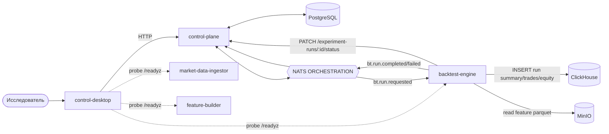
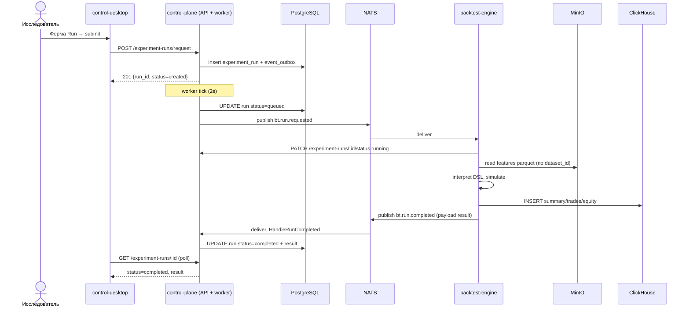
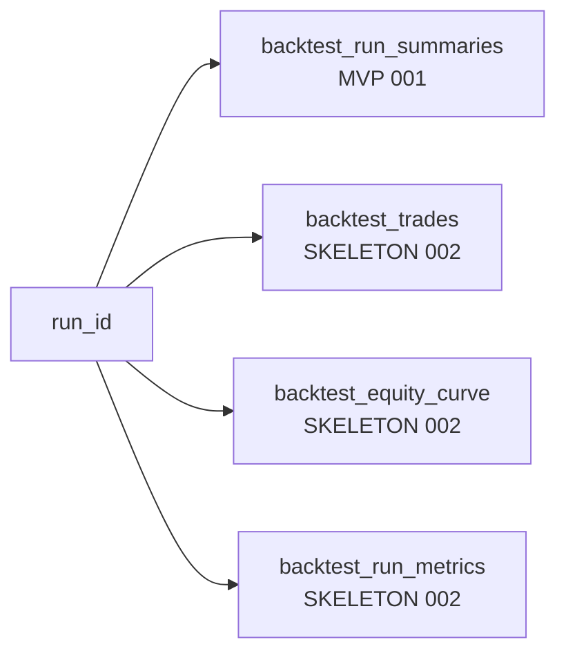

# Stage 3 — Backtest Engine + Control Desktop

**Статус:** IN PROGRESS. Текущий фокус проекта. Этап 2 закрыт и является предпосылкой. Самый насыщенный документ по объёму «что уже есть» и «что осталось».

Возврат к [project-spec.md](../project-spec.md).

---

## Цель этапа

1. Перевести стратегии на **декларативный DSL** ([ADR-004](../architecture/adr-004-backtest-dsl.md)). В stage 3 **v1 — активный контракт** (frozen MVP, валидируется в control-plane), **v2 — draft** (композируемый AST, `entries[]/exits[]`, feature_requirements, position/risk/portfolio/time/execution models) лежит рядом для review; активация v2 — отдельная задача после заморозки.
2. Собрать **детерминированный backtest-engine**, интерпретирующий DSL, читающий feature parquet из MinIO и пишущий результаты в **ClickHouse**. Параллелизм — между прогонами, внутри одного run — строго последовательный bar loop.
3. Выстроить оркестрацию прогонов через control-plane: реестр экспериментов и runs, постановка через NATS (`bt.run.requested`), финализация по `bt.run.completed`/`bt.run.failed`. **Terminal state владеет control-plane**: engine не делает PATCH `completed/failed`, только публикует событие.
4. **control-desktop** — основной GUI-оркестратор для всего полного контура: данные → фичи → бэктест → просмотр ошибок, без обязательного CLI.

---

## Scope

**В рамках:**

- JSON Schema DSL v1 (`schema_version`, `instrument_scope`, `entry`, `exit`, `filters`, `risk`, `execution`) — активный контракт.
- DSL v2 draft: каркас [schemas/strategy/v2/strategy.schema.json](../../services/control-plane/schemas/strategy/v2/strategy.schema.json) + [README](../../services/control-plane/schemas/strategy/v2/README.md) под review; валидатор не активируется в этом стейдже.
- Реестр `strategy_templates`, `strategy_versions` в control-plane с immutable-правилом.
- Реестр `experiment_batches`, `experiment_runs` с привязкой к feature dataset, диапазону дат, параметрам.
- Публикация команд через outbox + NATS, обработка терминальных событий. Terminal PATCH — за control-plane worker'ом.
- Runtime в backtest-engine на базе v1: bar-iteration, feature parquet reader, order/fill-модель, PnL, equity curve.
- Модель результатов в ClickHouse: ровно четыре таблицы — `backtest_run_summaries`, `backtest_trades`, `backtest_equity_curve`, `backtest_run_metrics`.
- `control-desktop`: полноценный UI для всех сценариев этапов 2 и 3.

**Out of scope:**

- Активация валидатора DSL v2 (делается отдельным стейджем после заморозки schema).
- Subject `cp.experiment.created`: в каталоге присутствует как `PLANNED`, но в stage 3 не реализуется и не потребляется — без реального сценария (pre-warm run slots, batch planning, warm caches) он добавляет асинхронной сложности без пользы.
- ClickHouse-таблицы `backtest_positions`, `backtest_scenario_rankings`, `backtest_period_metrics_*` — следующая итерация.
- Мультибиржевая поддержка (только Binance USDⓈ-M из этапа 2).
- Live-трейдинг.
- Расчёт results-aggregations через отдельный API (это этап 4).
- LLM (этап 5).

---

## Архитектура

### Контекст



### Sequence: submit run → результат в CH



---

## DSL (ADR-004)

Канонический источник схемы — [schemas/strategy/v1/strategy.schema.json](../../services/control-plane/schemas/strategy/v1/strategy.schema.json). Пример валидного документа (соответствует §8.1 устава):

```json
{
  "schema_version": "1.0.0",
  "strategy_code": "ema_rsi_breakout",
  "instrument_scope": {
    "exchange": "binance",
    "symbols": ["BTCUSDT", "ETHUSDT"]
  },
  "entry":   { "type": "indicator_condition", "params": { "left": "ema_20_gt_ema_50", "right": "rsi_14_lt_30000" } },
  "exit":    { "type": "tp_sl", "params": { "take_profit_bps": 400, "stop_loss_bps": 150 } },
  "filters": [ { "type": "regime_filter", "params": { "allowed": ["trend_up", "trend_down"] } } ],
  "risk":    { "type": "fixed_fraction", "params": { "risk_bps": 100 } },
  "execution": { "fee_bps": 10, "slippage_bps": 5, "allow_short": false }
}
```

Правила (зафиксированы в [ADR-004](../architecture/adr-004-backtest-dsl.md)):

- JSON Schema **валидируется в control-plane** при публикации `strategy_version`.
- После публикации версия **immutable** (нет PUT/PATCH тела).
- **Только backtest-engine** интерпретирует DSL. Никто больше не парсит `dsl_json` для принятия торговых решений.

Текущий статус:

- Таблицы и HTTP-эндпоинты **есть** (см. секцию «Реализация»).
- **JSON Schema DSL v1 — ACTIVE.** Схема в [schemas/strategy/v1/strategy.schema.json](../../services/control-plane/schemas/strategy/v1/strategy.schema.json), валидатор — [schemas/strategy/v1/validator.go](../../services/control-plane/schemas/strategy/v1/validator.go), подключен в `cmd/api/main.go` и вызывается в `POST /strategy-versions` до записи в БД. Невалидный DSL → `422 Unprocessable Entity` с структурированным `{error, issues[]}`.
- **JSON Schema DSL v2 — DRAFT.** Каркас в [schemas/strategy/v2/strategy.schema.json](../../services/control-plane/schemas/strategy/v2/strategy.schema.json) и README. Не wired, не активируется, `POST /strategy-versions` по-прежнему принимает только `schema_version: 1.x.y`. Активация v2 — отдельный стейдж после review/freeze ([ADR-004](../architecture/adr-004-backtest-dsl.md)).

---

## Сущности и контракты

### PostgreSQL (control-plane)

| Таблица | Роль |
|---|---|
| `strategy_templates` | Шаблон стратегии с уникальным `code` |
| `strategy_versions` | Immutable версия DSL конкретного template'а (тело DSL, `schema_version`, статус) |
| `experiment_batches` | Группа прогонов (feature_set_version, symbol_universe, диапазон, параметры) |
| `experiment_runs` | Одиночный прогон: `experiment_batch_id`, `strategy_version_id`, параметры, `status`, `result` |

Важное предупреждение по миграциям — см. раздел «Риски и критические пункты».

### ClickHouse — модель результатов



**Уже есть**:

- MVP summary — [001_init.sql](../../services/backtest-engine/migrations/clickhouse/001_init.sql): единственная таблица `default.backtest_run_summaries(run_id, symbol, engine_version, created_at)` с `ENGINE = MergeTree() ORDER BY (run_id, created_at)`. Именно туда `cmd/worker` пишет одну строку.
- Skeleton канонических таблиц результатов — [002_backtest_results.up.sql](../../services/backtest-engine/migrations/clickhouse/002_backtest_results.up.sql), **DDL применяется, но engine их ещё не заполняет**:
  - `backtest_trades(run_id, trade_index, symbol, side Enum8, entry_time, exit_time, entry_price, exit_price, quantity, pnl_abs, pnl_bps, fees_abs, slippage_bps, regime_code, created_at)` — `PARTITION BY toYYYYMM(entry_time) ORDER BY (run_id, trade_index)`, codec `DoubleDelta, ZSTD(3)` на временах.
  - `backtest_equity_curve(run_id, ts, equity, drawdown_abs, drawdown_pct, created_at)` — `PARTITION BY toYYYYMM(ts) ORDER BY (run_id, ts)`.
  - `backtest_run_metrics(run_id, strategy_version_id, symbol, period_from, period_to, pnl_abs, pnl_pct, sharpe_ratio, sortino_ratio, max_drawdown_abs, max_drawdown_pct, trades_total, trades_won, trades_lost, profit_factor, expectancy, regime_breakdown_json, created_at, version)` — `ReplacingMergeTree(version) ORDER BY (run_id)` для идемпотентных rerun'ов.

Открытые вопросы:

- TTL/retention — пока не назначен, см. §7.4 устава.
- `backtest_run_metrics` фиксированно-колоночный; если появятся произвольные метрики — перейти на EAV-таблицу или добавить `metrics_extras_json`.
- В 002 не заведены таблицы `backtest_positions`, `backtest_scenario_rankings` и периодические агрегации (`backtest_period_metrics_{month,quarter,year}`) из §7.4 устава — это следующая итерация, вероятно в 003.

### События (этап 3)

| Subject | Producer | Consumer | Статус |
|---|---|---|---|
| `bt.run.requested` | control-plane worker (из `event_outbox`) | backtest-engine (durable `backtest-engine-bt-run-v1`, `DeliverNew`) | DONE (транспорт) |
| `bt.run.completed` | backtest-engine (JS publish) | control-plane worker (durable `control-plane-bt-run-completed-v1`) | DONE (транспорт), payload будет богаче |
| `bt.run.failed` | backtest-engine | control-plane worker (durable `control-plane-bt-run-failed-v1`) | DONE (транспорт) |
| `cp.experiment.created` | control-plane | — (нет потребителя в stage 3) | **OUT OF SCOPE для stage 3** — в каталоге остаётся `PLANNED`, в коде не используется. Активация откладывается до появления реального сценария (pre-warm run slots, batch planning, prefetch datasets). |
| `llm.reindex.requested` | control-plane | llm-analyst (этап 5) | OUT OF SCOPE для этапа 3 |

Каталог: [docs/api/event-catalog.md](../api/event-catalog.md).

---

## API control-plane для этапа 3

Уже реализовано в [handlers.go](../../services/control-plane/internal/adapters/http/handlers.go) — состав эндпоинтов:

| Метод | Путь | Статус |
|---|---|---|
| POST | `/api/v1/strategy-templates` | DONE |
| GET | `/api/v1/strategy-templates/{code}` | DONE |
| POST | `/api/v1/strategy-versions` | DONE (но **валидация DSL** — TODO) |
| GET | `/api/v1/strategy-versions/{id}` | DONE |
| POST | `/api/v1/experiment-batches` | DONE |
| GET | `/api/v1/experiment-batches/{id}` | DONE |
| POST | `/api/v1/experiment-runs/request` | DONE |
| GET | `/api/v1/experiment-runs/{id}` | DONE |
| PATCH | `/api/v1/experiment-runs/{id}/status` | DONE |

---

## Реализация — что уже есть

### control-plane — IN PROGRESS

- HTTP API стратегий/экспериментов/runs реализован ([handlers.go](../../services/control-plane/internal/adapters/http/handlers.go)).
- Go-код в [internal/app/registry.go](../../services/control-plane/internal/app/registry.go) содержит `HandleRunCompleted`, `HandleRunFailed` — worker корректно принимает терминальные события и финализирует run.
- Outbox worker публикует `bt.run.requested` после `queued`-перевода.
- JetStream stream `ORCHESTRATION` включает subjects `bt.>`.

### backtest-engine — MVP ORCHESTRATION STUB

Весь код — в одном файле: [cmd/worker/main.go](../../services/backtest-engine/cmd/worker/main.go). В `go.mod` только `clickhouse-go`, `uuid`, `nats.go` — ни MinIO, ни Parquet зависимостей.

Текущий happy-path:

1. Consumer `bt.run.requested` (queue `backtest-engine`, durable `backtest-engine-bt-run-v1`).
2. `PATCH /api/v1/experiment-runs/{id}/status` с `status=running` (нет `result`).
3. `INSERT INTO backtest_run_summaries` одной строкой `(run_id, symbol, 'mvp', now())`.
4. Summary **захардкожен** — `{"engine":"mvp","rows":0}`.
5. `publish bt.run.completed` с этим summary. Ошибка → `publish bt.run.failed`.
6. **PATCH в `completed`/`failed` не выполняется**; финализацию делает control-plane worker по NATS-событию.

### control-desktop — IN PROGRESS

- Стек подтверждён: Wails v2 + Go 1.24 + TypeScript/Vite. [wails.json](../../services/control-desktop/wails.json), [go.mod](../../services/control-desktop/go.mod), [frontend/package.json](../../services/control-desktop/frontend/package.json).
- Go backend с полноценным [app.go](../../services/control-desktop/app.go): startup готовит BackupDir, Managed Processes, Local Sync (NATS → архивация датасетов).
- **Wails-bound методы** (из [App.d.ts](../../services/control-desktop/frontend/wailsjs/go/main/App.d.ts)): `CheckReadyz`, `GetBackfillProgress`, `GetBackupInfo`, `GetCandleCoverageJSON`, `GetDataset`, `GetDefaultDataDir`, `GetExperimentRun`, `GetHealthSummaryJSON`, `GetJob`, `GetLocalArchiveStatus`, `GetProcessLogTail`, `GetResolvedDataDir`, `GetSettings`, `ListDatasetPartitions`, `ListDatasets`, `ListJobs`, `ListManagedProcesses`, `ProbeHTTPReadyz`, `RefreshManagedProcesses`, `RequestBackfill`, `RequestExperimentRun`, `RequestFeatureBuild`, `RequestFeatureBuildForm`, `RunSmokeE2E`, `SaveSettings`, `StartBackfillJob`, `StartManagedProcess`, `StopManagedProcess`, `ValidateBackupFolder`, `ValidateDataset`.
- Интеграция с CP через [cpclient/client.go](../../services/control-desktop/internal/cpclient/client.go): `GetJSON`, `PostJSON`, `PatchJSON`, `GetReadyz`. Base URL — из `Settings.ControlPlaneURL`, дефолт `http://localhost:8080`. MDI URL — из `Settings.MarketDataIngestorURL`, дефолт `http://localhost:8081`.
- Локальный архив и резервные копии: [backup/backup.go](../../services/control-desktop/internal/backup/backup.go) — manifest v1, `app_id` `algorhythm`, создание структуры `backups/auto`, `imports/`, `exports/`.
- **Shipped SPA** — в [frontend/dist/](../../services/control-desktop/frontend/dist). Хеш-роутер и набор экранов уже работает:

| Маршрут | Назначение |
|---|---|
| `#/home` | Каталог-хаб с плитками операций/данных/research/system |
| `#/overview` | Jobs, datasets, CP health summary |
| `#/jobs` | Список и детали джобов, прогресс backfill |
| `#/datasets` | Реестр датасетов, партиции, действия |
| `#/backfill` | Форма запуска backfill + карта покрытия |
| `#/features` | Запуск build-feature-set (форма и JSON) |
| `#/validation` | Deep validation через market-data-ingestor |
| `#/health` | CP health summary + probes |
| `#/data` | Сырые POST/GET к API для отладки |
| `#/experiments` | Запрос experiment run, просмотр run по ID, smoke E2E |
| `#/processes` | Managed local processes (старт/стоп backend'ов) |
| `#/backup` | Локальные бэкапы, archive status, валидация папки |
| `#/settings` | URLs, data dir, Local Archive toggles |

---

## Что осталось — TODO

### control-plane

1. **Schema vs code alignment — DONE.** Миграция [000006_strategy_experiment_align.up.sql](../../services/control-plane/migrations/000006_strategy_experiment_align.up.sql) подключена в [embed.go](../../services/control-plane/migrations/embed.go). Полный `reset-cold-start` + `migrate up` от 000001 до 000006 на чистой БД прогонялся; `POST /strategy-templates`, `POST /strategy-versions`, `POST /experiment-batches` работают без ручных шагов.

2. **JSON Schema DSL v1 — DONE.** Валидатор в [schemas/strategy/v1/validator.go](../../services/control-plane/schemas/strategy/v1/validator.go) (библиотека `github.com/santhosh-tekuri/jsonschema/v6`), тесты в `validator_test.go`, wired в [cmd/api/main.go](../../services/control-plane/cmd/api/main.go) и [internal/adapters/http/handlers.go](../../services/control-plane/internal/adapters/http/handlers.go). Невалидный payload → `422 {error, issues[]}`. Cross-field: `dsl_json.strategy_code == strategy_template_code`.

3. **JSON Schema DSL v2 — DRAFT published.** [schemas/strategy/v2/strategy.schema.json](../../services/control-plane/schemas/strategy/v2/strategy.schema.json) + подробный [README](../../services/control-plane/schemas/strategy/v2/README.md) с таблицей сравнения v1↔v2 и runtime-контрактом. Активация (new `dslv2` package, dispatch по `schema_version` в handlers) — **отдельный стейдж после review**, не в scope stage 3.

4. **`cp.experiment.created` — OUT OF SCOPE.** Оставлен как `PLANNED` в [event-catalog.md](../api/event-catalog.md), в коде не публикуется и не потребляется. Возвращаемся к этому вопросу только когда появится сценарий, требующий pre-materialize run slots / prefetch datasets / warm caches / batch planning.

5. **Обогатить `result` джобов/runs** стандартным envelope'ом: `engine_version`, `clickhouse_summary_ref`, `trade_count`, `pnl_summary`, `artifact_paths`. Согласовать с backtest-engine payload'ом. Зависимость для engine runtime.

6. **`PATCH /experiment-runs/:id/result-merge`** — по аналогии с `/jobs/:id/result-merge`, чтобы backtest-engine мог докладывать `result` частями (опционально).

### backtest-engine — основная масса работ

Переход из «orchestration stub» в реальный симулятор. Порядок соответствует ADR-004 v2 (сначала контракт → потом foundations → потом симулятор):

**Foundations (после freeze v2):**

1. **CP client.** GET `strategy-versions/{id}`, GET `experiment-runs/{id}`, GET dataset + partitions, PATCH `running`. Заменить захардкоженный `"mvp"` summary. **Terminal PATCH (`completed`/`failed` с `result`) НЕ делает engine** — см. п. «Владелец terminal state» в ADR-004 v2; engine публикует только NATS-событие.
2. **S3/MinIO adapter + Parquet reader.** Зависимости: `minio-go`, `parquet-go`. Добавить `internal/storage/` (MinIO adapter — DONE, M2), `internal/parquet/feature_reader.go` (M3, reads selected columns + dedupes cross-month). Читать по `dataset_id` от CP. Канонический межсервисный контракт формата — [feature-parquet-v1.md](../contracts/feature-parquet-v1.md) (ACCEPTED).
3. **DSL парсер и AST.** `internal/domain/strategy.go` + `internal/app/dsl/parse.go`. Разбор по major-версии `schema_version`: v1 → legacy структура, v2 → AST (conditionNode, entries[], exits[] с discriminated union по `kind`).
4. **Feature compatibility validator.** Перед bar loop: резолвит `feature_requirements.required_features` (v2) или используемые индикаторы (v1) в индексы колонок parquet; при несовпадении — `bt.run.failed` с `reason: feature_missing`.

**Симулятор:**

5. **Deterministic bar iterator.** Плотное итерирование minute-bar. Фиксированный порядок чтения партиций, columnar-ish layout (contiguous slices), никаких `range map` в hot path. Seeded rng из `run_id` для stochastic-блоков. Single-thread per run; параллелизм только между прогонами.
6. **Order simulator / fill model.** Market с `slippage_bps`/`fee_bps` (v1) или модельный `fee_model`+`slippage_model`+`fill_model` (v2); позже — limit с partial fills.
7. **Portfolio / equity curve.** Позиции, cash, margin (фьючерсы), fees. Для v2 — учитывает `position_management` (scale_in/out, partial TP, pyramiding).
8. **Метрики и PnL.** PnL по трейду, equity timeline, drawdown, Sharpe, Sortino, win rate, profit factor, expectancy (поля уже есть в `backtest_run_metrics`).
9. **Writer в ClickHouse.** Наполнение `backtest_trades`, `backtest_equity_curve`, `backtest_run_metrics` (DDL уже в 002). Идемпотентный rerun через `ReplacingMergeTree(version)` в metrics.
10. **Indicators runtime (fallback).** Только для сценариев, не покрытых feature-парке. По умолчанию **выключено**: основной путь — precomputed features из feature-builder (ADR-004 v2).

**Прочее:**

11. **Error paths.** Payload `bt.run.failed` с типизированными ошибками (`feature_missing`, `dsl_invalid`, `data_missing`, `runtime_panic`).
12. **Config/env.** `BT_MINIO_*`, `BT_S3_BUCKET`, `BT_CP_URL`.
13. **Детерминизм.** Фиксация iteration order, seeded rng, выравнивание timestamp'ов, никаких map на hot path.

**Решено, не делаем в этом стейдже:**

- Engine НЕ делает terminal PATCH — это зона control-plane worker'а.
- `cp.experiment.created` НЕ консьюмится.
- Параллелизм внутри одного run НЕ реализуется (deterministic-first).

### ClickHouse

- Skeleton-миграция `002_backtest_results.up.sql` уже применяется (см. «Сущности и контракты → ClickHouse»). TODO: начать писать из `backtest-engine` (зависит от пункта про runtime выше).
- Партиционирование зафиксировано: `backtest_trades` — по `toYYYYMM(entry_time)`, `backtest_equity_curve` — по `toYYYYMM(ts)`, `backtest_run_metrics` — без партиционирования (одна строка на run). Решения по `backtest_positions`, `backtest_scenario_rankings`, `backtest_period_metrics_*` — в следующих миграциях.
- TTL/retention: пока не определено; вернуться к вопросу при переходе на боевые объёмы.

### control-desktop

1. **TS source tree — OK.** `frontend/src/` содержит полный TypeScript-стек (13 экранов: `home`, `overview`, `jobs`, `datasets`, `backfill`, `features`, `validation`, `health`, `settings`, `data`, `experiments`, `processes`, `backup`), `api/wails.ts`, `app.ts`, `layout.ts`, `router.ts`, `main.ts`, `lib/*.ts`, `navigation/`, `types/`, `tsconfig.json`. **Атомарная архитектура:** `ui/atoms.ts` + `ui/molecules.ts` + `ui/organisms.ts` (добавлен на этапе наведения порядка) + re-export через `ui/index.ts`. Ранее в git было путающее состояние с `D` на `.js` + `??` на `.ts` — после коммита ведущего к этому документу оно схлопнется до актуального TS.

2. **Дорефакторить экраны на organisms.** `ui/organisms.ts` содержит `orgPage`, `orgLogCard`, `orgActionsCard`, `orgDataTableCard`, `orgStatsLogCard`, `orgKeyValueList` — это вынесенные повторы из `screens/*.ts`. Экраны пока собирают `innerHTML` вручную через molecules и inline-HTML. Постепенно переписать каждый экран, чтобы inline-HTML не было в screens/ (только вставки значений).

3. **Экраны для этапа 3:**
   - `#/strategies` — список `strategy_templates`, создание и публикация `strategy_version` через форму с JSON-редактором DSL (после активации валидатора в CP — с предварительной проверкой).
   - `#/experiments` (обогатить) — создание `experiment_batch`, выбор feature_set_version и инструментов, список `experiment_runs`.
   - `#/runs/:id` — детальный просмотр run'а: `status`, `result`, ссылки на CH-записи, отображение ошибки из `bt.run.failed`.

4. **Интеграция с results-api** отложена до этапа 4.

### Инфраструктура и observability

1. **docker-compose зависимости backtest-engine ↔ CH/NATS/MinIO** — сейчас в `ops/full-stack` нет engine'а; по [ADR-001](../architecture/adr-001-meta-repo-and-submodules.md) каждый сервис имеет свой compose, но корневой может быть как оркестратор. Либо добавить в `ops/full-stack/docker-compose.yml` блок для `backtest-engine`, либо держать его отдельным.
2. **`trace_id` сквозной.** Все envelope'ы NATS уже содержат `trace_id`; привязать к логам всех сервисов через `slog` context.
3. **Smoke E2E тест этапа 3.** Скрипт [scripts/smoke-e2e.ps1](../../scripts/smoke-e2e.ps1) есть и делает цикл «experiment → run → CH»; расширить на realistic DSL после появления валидатора.

---

## Критерии завершения (DoD)

| Критерий | Привязка |
|---|---|
| JSON Schema DSL v1 опубликована и лежит в CP; `POST /strategy-versions` валидирует тело | **DONE** (schema + validator + tests + wired, `422` на невалидный DSL) |
| ADR-004 v2 + каркас schema v2 опубликованы под review (композируемый AST, entries[]/exits[], feature_requirements, position/risk/portfolio/time/execution) | **DONE — DRAFT** |
| Схема PG в CP приведена в соответствие с Go-кодом (стратегии/эксперименты/runs) | **DONE** (миграция 000006 подключена, dead `001_init_schema.sql` удалён, cold-start + migrate up прогон пройден) |
| ClickHouse содержит `backtest_run_summaries` + `backtest_trades` + `backtest_equity_curve` + `backtest_run_metrics` с партиционированием | **DONE — DDL и deterministic placeholder writer пишет все 4 таблицы;** реальное наполнение из нормального симулятора — TODO |
| backtest-engine читает feature parquet из MinIO по `dataset_id` | TODO |
| backtest-engine интерпретирует DSL-блоки `instrument_scope/entry/exit/filters/risk/execution` и прогоняет симуляцию детерминированно | TODO |
| События `bt.*` end-to-end с идемпотентностью: повторный `bt.run.requested` с тем же `run_id` не создаёт дубль | IN PROGRESS (durable + `DeliverNew` уже есть, нужно покрыть сценарий) |
| control-plane корректно финализирует `experiment_run` на `bt.run.completed`/`failed` с сохранением `result` (единственный владелец terminal state) | DONE (consumer есть, надо сверить payload shape после обогащения) |
| control-desktop: полная атомарная архитектура `atoms → molecules → organisms → screens`; inline-HTML только в organisms/molecules | **DONE** (screens переписаны на `orgPage` + organism-карточки, inline-HTML вынесен) |
| control-desktop: пользовательский сценарий «данные → фичи → поставить run → увидеть результат» без CLI | IN PROGRESS (данные и фичи — работает; run/result — зависит от готовности engine) |
| Документация в `docs/` обновлена (integration-map, event-catalog, и при появлении CH-схемы — ADR) | Ongoing |
| Смоук e2e-скрипт для этапа 3 проходит в корне репо | TODO |

---

## Риски и критические пункты

1. ~~**Schema vs code drift в control-plane.**~~ Устранено миграцией 000006 и удалением `001_init_schema.sql`. Осталось: прогнать полный `reset-cold-start` + `migrate up` от 000001 до 000006 на чистой БД и убедиться, что `POST /strategy-templates` и `POST /experiment-batches` корректно вставляют данные.

2. **Недетерминизм в Go.** `for ... range map[...]` — рандомная итерация. Любые map-проходы в engine'е должны сортировать ключи, либо работать через slice'ы. Любой stochastic-блок DSL обязан получать **seeded rng** из `run_id`.

3. **Backpressure JetStream при массовых прогонах.** Если experiment_batch инициирует тысячи runs одновременно, outbox + NATS + engine должны выдерживать. План: батчированный publish из outbox, ограничение concurrency в engine через `MaxAckPending`.

4. **Объём ClickHouse.** 10^6 runs × 10^2 trades × N колонок — десятки-сотни миллионов строк в месяц. Partition keys в 002 выбраны под «читаем несколько месяцев или один run подряд»; при сдвиге сценариев (например, «все runs за один день») — пересмотреть `ORDER BY`. `backtest_run_metrics` на `ReplacingMergeTree(version)` — идемпотентные rerun'ы одного `run_id` перекрывают предыдущие без дублей.

5. **Overlap границ месяцев в feature parquet (наследие этапа 2).** Engine, читающий несколько месяцев подряд, обязан дедуплицировать по `timestamp_utc`. См. [stage-2-data-layer.md#reality-check](stage-2-data-layer.md#reality-check---важные-особенности-реализации).

6. ~~**Фронт control-desktop работает только из `dist/`.**~~ Подтверждено обратное: `frontend/src/` содержит полный TS source tree, `tsconfig.json` и atoms/molecules/organisms. `npm run dev` и `wails dev` работают из исходников.

---

## Ссылки

- [ADR-003: Границы сервисов](../architecture/adr-003-service-boundaries.md)
- [ADR-004: DSL стратегии](../architecture/adr-004-backtest-dsl.md)
- [ADR: health http workers](../architecture/adr-health-http-workers.md)
- [Каталог событий NATS](../api/event-catalog.md)
- [Карта интеграций](../api/integration-map.md)
- [Технический устав §8, §10](../../trading_platform_technical_charter.md)
- Код: [backtest-engine](../../services/backtest-engine), [control-plane strategy_experiment](../../services/control-plane/internal/adapters/postgres/strategy_experiment.go), [control-desktop](../../services/control-desktop)
- Скрипты: [scripts/smoke-e2e.ps1](../../scripts/smoke-e2e.ps1)
