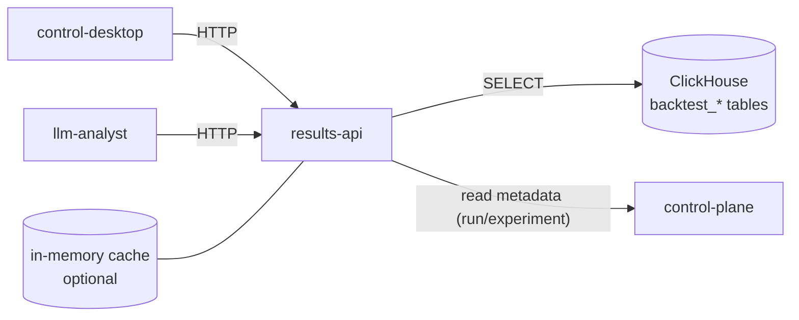

# Stage 4 — Results API

**Статус:** **IN PROGRESS** — submodule `services/results-api`: read API, compare, optional API key, **LRU+TTL кэш** сводок по run, **rate limit** на `/api/...`, **OpenAPI 3.1** (исходник `internal/openapispec/openapi.yaml`, выдача `GET /openapi.yaml`). Дальше — агрегаты, leaderboard, эндпоинты из раздела API ниже, которые ещё не в коде, выдача ключей через control-plane.

Возврат к [project-spec.md](../project-spec.md).

---

## Цель этапа

Реализовать отдельный сервис `results-api` — **read-only HTTP API поверх ClickHouse** — как единственный санкционированный способ чтения результатов бэктестов для внешних потребителей (control-desktop, LLM-analyst, сторонние аналитические клиенты).

Основной тезис: backtest-engine владеет записью, results-api — чтением. Ни один другой сервис не выполняет произвольный SQL против ClickHouse.

---

## Scope

**В рамках:**

- Новый submodule `services/results-api` (имя репозитория — `algorhythm-results-api`).
- OpenAPI 3.1 спецификация в репозитории сервиса.
- Эндпоинты: сводка по run, агрегаты по experiment, leaderboard, фильтры по инструменту/периоду.
- Кэш (in-memory LRU или Redis — на проектировании) для горячих агрегатов.
- Базовая авторизация наружу: API key через reverse proxy или аналог.

**Out of scope:**

- Запись результатов — только backtest-engine ([ADR-003](../architecture/adr-003-service-boundaries.md)).
- Произвольный SQL через API.
- GUI (работа с desktop — в этом же этапе как интеграция, но новые экраны — задача этапа 4+).

---

## Архитектура

Обоснование: [ADR-003](../architecture/adr-003-service-boundaries.md) требует отдельный сервис для read-only витрины.

---

## API (draft v1)

| Метод | Путь | Назначение |
|---|---|---|
| GET | `/healthz`, `/readyz` | Probes |
| GET | `/api/v1/runs/{run_id}/summary` | Сводка по одному run (equity_final, trades_count, pnl, max_drawdown, sharpe, fees_total) |
| GET | `/api/v1/runs/{run_id}/trades?limit=&offset=` | Список trades с курсором |
| GET | `/api/v1/runs/{run_id}/equity-curve?granularity=1m\|1h\|1d` | Equity curve |
| GET | `/api/v1/experiments/{batch_id}/runs` | Список runs по experiment batch |
| GET | `/api/v1/experiments/{batch_id}/aggregates?metric=sharpe\|maxdd\|pnl\|winrate&groupby=symbol\|month` | Предагрегаты |
| GET | `/api/v1/leaderboard?strategy_version_id=&feature_set_version_id= (alias)&period=all\|month\|quarter\|year&metric=…&limit=` | Топ runs из **`backtest_run_metrics`** (CH 002) |
| GET | `/api/v1/metrics/run/{run_id}` | Полная строка **`backtest_run_metrics`**, включ. `version` / `created_at` (EAV-таблицы `backtest_metrics` в DDL нет) |

Все ответы — JSON. Диапазоны дат в ISO 8601 UTC.

### Авторизация

- API key через заголовок `X-API-Key`. Список допустимых ключей: env **`RESULTS_API_API_KEYS`** (comma-separated); пустой — без auth (dev). Выдача через control-plane — по-прежнему TODO; reverse proxy — опционально.
- В будущем: интеграция с OIDC/SSO — отдельный ADR.

---

## Сущности и зависимости

- Читает только ClickHouse из этапа 3: `backtest_run_summaries` (маркер), `backtest_trades`, `backtest_equity_curve`, **`backtest_run_metrics`** (сводка по run, ReplacingMergeTree). Ничего из `backtest_period_metrics_*` / MV в текущем DDL. Никаких local tables.
- Метаданные run/experiment (имя стратегии, feature_set_version, символы) — **HTTP GET к control-plane** при необходимости; никакого прямого доступа к PostgreSQL CP.
- ClickHouse DSN — отдельный `RESULTS_API_CLICKHOUSE_DSN` с read-only учёткой.

---

## Что нужно сделать

### 4.1 Заготовка сервиса

- Создать репозиторий `algorhythm-results-api`, подключить submodule `services/results-api`.
- Hexagonal layout: `cmd/api`, `internal/{domain,ports,adapters,app}`.
- Dockerfile, Makefile, `docker-compose.yml`, `.env.example`.
- Health probes, `slog`-логирование с `trace_id`.

### 4.2 Чтение ClickHouse

- Адаптер `internal/adapters/clickhouse/` поверх `clickhouse-go`.
- Запросы: готовые, никакой динамической сборки из пользовательских строк.
- Параметризация через `?` с типизированными биндами.

### 4.3 OpenAPI

- `openapi/openapi.yaml` с полной спецификацией эндпоинтов, схемами, ошибками. Тот же подход, что в остальных сервисах.
- Сгенерировать клиент для control-desktop (опционально).

### 4.4 Кэш

- Начать с in-memory LRU (`github.com/hashicorp/golang-lru/v2` или аналог) с TTL. Ключ — нормализованные параметры запроса.
- Inv пока делать по TTL; при появлении `bt.run.completed` события — опциональная инвалидация по run_id (NATS consumer).

### 4.5 Leaderboard и period aggregates

- Реализовать как regular SELECT'ы; если нагрузка потребует — перейти на **ClickHouse materialized views** (решение в отдельном ADR при реализации).

### 4.6 Интеграция с control-desktop

- Добавить в `Settings` поле `ResultsAPIURL`, дефолт `http://localhost:8082`.
- Экран `#/results/run/:id` и `#/leaderboard` в control-desktop (зависит от восстановления `src/`-tree desktop'а — см. stage-3).

---

## Критерии завершения (DoD)

| Критерий | Статус |
|---|---|
| Submodule создан, сервис собирается и запускается | TODO |
| OpenAPI 3.1: все **реализованные** пути + пробы; `GET /openapi.yaml` | **PARTIAL** (experiments/aggregates / некоторые query-параметры из драфта — TODO) |
| Эндпоинт `GET /api/v1/runs/{id}/summary` и метрики/leaderboard — по CH | **MVP (код + DDL 002)** |
| Leaderboard: топ-N, period, metric, strategy_version | **MVP** (см. `GET /api/v1/leaderboard`) |
| API key (optional): `RESULTS_API_API_KEYS` + `X-API-Key` | **PARTIAL** (без CP-выдачи ключей) |
| control-desktop читает results-api через `ResultsAPIURL` | TODO |
| Нагрузочный sanity test (например, 500 rps по leaderboard) | TODO |

---

## Зависимости и риски

- **Зависит от этапа 3 / DDL 002:** контракт фиксирован в `migrations/clickhouse/002_backtest_results.up.sql`; read-side использует `FINAL` для `backtest_run_metrics` где нужно. Расширенные `*_period_metrics_*` — отдельные миграции.
- **ClickHouse DSN и доступы**: разделить `write` (backtest-engine) и `read-only` (results-api) учётки.
- **Cache invalidation**: если пойти путём NATS-триггеров, получим зависимость от NATS при read pathway. На старте — только TTL.

---

## Ссылки

- [ADR-002: Модель хранения данных](../architecture/adr-002-data-storage-model.md)
- [ADR-003: Границы сервисов](../architecture/adr-003-service-boundaries.md)
- [stage-3-backtest-and-desktop.md](stage-3-backtest-and-desktop.md)
- [Каталог событий NATS](../api/event-catalog.md)
- [Технический устав §6.5, §10](../../trading_platform_technical_charter.md)
