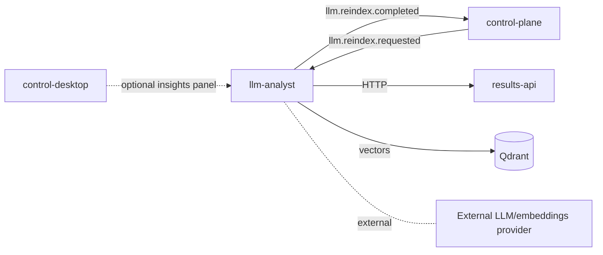

# Stage 5 — LLM Analyst

**Статус:** TODO. Финальный плановый этап. Стартует после стабилизации results-api (этап 4).

Возврат к [project-spec.md](../project-spec.md).

---

## Цель этапа

Построить слой семантического анализа и поиска по результатам бэктестов. Это единственный сервис платформы на **Python 3.12** ([техуставе §3.1](../../trading_platform_technical_charter.md)). Он отвечает за:

1. **Индексацию** прогонов (run), experiment batches, стратегий в Qdrant через embeddings.
2. **Семантический retrieval** — ответ на запросы «найди прогоны со стабильным Sharpe в боковике», «найди стратегии, похожие на эту».
3. **LLM-обогащённые инсайты** — короткие summary по run, сравнения экспериментов, гипотезы.

LLM **не** принимает решения по PnL и **не** становится источником истины. Он работает поверх агрегатов, возвращаемых `results-api`.

---

## Scope

**В рамках:**

- Новый submodule `services/llm-analyst` (репозиторий `algorhythm-llm-analyst`).
- Python 3.12, `pyproject.toml` / `uv` или `pip`, Dockerfile.
- Embedding pipeline: из run/experiment-метаданных в векторное представление → запись в Qdrant.
- HTTP API: `POST /api/v1/search`, `GET /api/v1/runs/{id}/insights`.
- Consumer NATS `llm.reindex.requested`.
- Publisher NATS `llm.reindex.completed`.
- Интеграция с results-api как основного источника данных.

**Out of scope:**

- Обучение собственных моделей — используем managed LLM / embeddings API (решение фиксируется в ADR на этапе 5).
- Прямой доступ к ClickHouse и PostgreSQL.
- Замена results-api в чём-либо.

---

## Архитектура

Обоснование: техустав §6.6; [ADR-002](../architecture/adr-002-data-storage-model.md) фиксирует Qdrant как обязательный векторный store.

---

## API (draft v1)

| Метод | Путь | Назначение |
|---|---|---|
| GET | `/healthz`, `/readyz` | Probes |
| POST | `/api/v1/search` | Семантический поиск: body `{query, filters, top_k}` → `[ { run_id, score, snippet } ]` |
| GET | `/api/v1/runs/{run_id}/insights` | LLM-summary конкретного run (PnL-разбор, режим, похожие эксперименты) |
| POST | `/api/v1/reindex` | Пересбор индекса (ручной триггер) |

---

## События NATS

| Subject | Producer | Consumer | Назначение |
|---|---|---|---|
| `llm.reindex.requested` | control-plane (или внешний триггер) | llm-analyst | Индексировать новые run'ы |
| `llm.reindex.completed` | llm-analyst | (без фиксированного consumer'а по каталогу) | Подтверждение завершения индексации |

Полный каталог: [docs/api/event-catalog.md](../api/event-catalog.md).

---

## Что нужно сделать

### 5.1 Скелет сервиса

- Репозиторий `algorhythm-llm-analyst`, подключить как submodule `services/llm-analyst`.
- Python 3.12, `pyproject.toml`, `Dockerfile`, `docker-compose.yml`, `.env.example`.
- Hexagonal-структура адаптирована под Python: `llm_analyst/{domain,ports,adapters,app}`.
- FastAPI для HTTP, `nats-py` для NATS, `qdrant-client`, `httpx` для вызовов results-api.

### 5.2 Pipeline индексации

- Получение новых run'ов (по событию `llm.reindex.requested` или по расписанию).
- Загрузка агрегатов из results-api (`GET /runs/{id}/summary`, `/metrics/run/{id}`).
- Формирование **текстового представления** run'а: стратегия, feature_set, символы, период, ключевые метрики, контекст режима (если есть). Шаблон хранится отдельно, версия `embedding_version`.
- Embedding через внешний провайдер (OpenAI / локальный sentence-transformer — выбор в ADR).
- Запись в Qdrant с payload'ом: `run_id`, `experiment_batch_id`, `strategy_version_id`, `symbol`, `period_from`, `period_to`, ключевые метрики.
- Публикация `llm.reindex.completed` с числом проиндексированных.

### 5.3 Retrieval / search

- `POST /search`: query → embedding → Qdrant ANN → top-k.
- Hybrid search (опционально): фильтры по payload (символ, период, метрика) + ANN.

### 5.4 Insights

- `GET /runs/{id}/insights`: краткий LLM-ответ по фиксированному шаблону промпта.
- Промпт получает агрегаты + ближайших соседей по embedding'у + краткую статистику. Никакой raw данных свечей.

### 5.5 Интеграция с control-desktop (опционально в этом этапе)

- Экран `#/insights` — поиск и просмотр insights. Зависит от состояния `src/` desktop'а (см. stage-3 риск).

---

## Критерии завершения (DoD)

| Критерий | Статус |
|---|---|
| Submodule создан, сервис поднимается в docker-compose | TODO |
| ADR выбора embedding-провайдера и промпт-шаблонов | TODO |
| Consumer `llm.reindex.requested` обрабатывает пакет run_id и публикует `llm.reindex.completed` | TODO |
| `POST /search` возвращает релевантные run_id с оценкой | TODO |
| `GET /runs/{id}/insights` возвращает стабильный detalizированный summary | TODO |
| Интеграция с results-api через HTTP (не прямой SQL к CH) | TODO |
| Опциональная панель в control-desktop | OPTIONAL |

---

## Зависимости и риски

- **Зависит от results-api** (этап 4). Без него LLM-аналитик не имеет санкционированного источника агрегатов.
- **Внешний LLM/embeddings provider**: цена, латентность, приватность данных. Требуется ADR.
- **Версионирование embedding'ов**: при смене модели — полная переиндексация; хранить `embedding_version` в payload'е Qdrant.
- **Галлюцинации LLM**: insights — всегда «LLM комментарий», а не метрика. Цифры — только из results-api.

---

## Ссылки

- [ADR-002: Модель хранения данных](../architecture/adr-002-data-storage-model.md) — Qdrant как обязательный векторный store
- [ADR-003: Границы сервисов](../architecture/adr-003-service-boundaries.md) — роль llm-analyst
- [stage-4-results-api.md](stage-4-results-api.md)
- [Каталог событий NATS](../api/event-catalog.md)
- [Технический устав §3.1, §6.6, §7.5](../../trading_platform_technical_charter.md)
