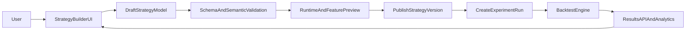
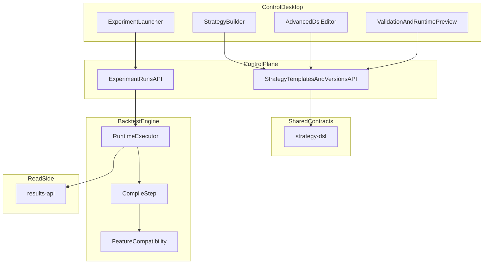

# Stage 6 — Strategy Authoring

**Статус:** IN PROGRESS. Первый MVP vertical slice уже реализован: `draft -> preflight -> publish -> run -> compare` собран end-to-end, но full product maturity и расширение runtime-supported subset ещё впереди. Максимальная ценность достигается вместе с дальнейшей зрелостью runtime-path и results-api.

Возврат к [project-spec.md](../project-spec.md).

---

## Цель этапа

Построить **удобную, адаптивную и подконтрольную систему создания стратегий**, в которой пользователь может:

- выбрать индикаторы и feature inputs;
- задать собственные условия открытия и закрытия позиции;
- отдельно управлять логикой:
  - `open_long`
  - `close_long`
  - `open_short`
  - `close_short`
- задавать stop-loss / take-profit / trailing / time-based exits;
- работать в режиме **signal-only**;
- работать в режиме **continuous / flip**:
  - после закрытия `short` сразу открывать `long`
  - после закрытия `long` сразу открывать `short`
- комбинировать filters, risk rules и execution options;
- видеть, что именно стратегия требует от данных и что реально поддерживается runtime.

Ключевой тезис этапа:

**стратегия должна стать не JSON-артефактом “для разработчика”, а удобным продуктовым объектом, который можно собрать, проверить, запустить и сравнить без ручной правки внутренностей платформы.**

---

## Зачем нужен отдельный этап

На момент начала этого этапа проект уже умеет:

- хранить стратегии как versioned DSL в `control-plane`;
- валидировать DSL через `strategy-dsl`;
- компилировать DSL в typed plan в `backtest-engine`;
- резолвить feature dataset и читать `FeatureFrame`;
- исполнять первый реальный `v1` runtime в backtest-engine;
- писать результаты бэктеста в ClickHouse.

Но этого **недостаточно**, чтобы считать “создание стратегий” готовым.

Сейчас платформа сильна как инфраструктура исполнения и данных, но ещё не закрывает product-level сценарий:

- быстро собрать новую стратегию;
- безопасно изменить правила;
- понять, какие данные нужны;
- увидеть, поддерживается ли этот сценарий runtime;
- запустить серию экспериментов;
- сравнить результаты версий стратегии.

Этот этап закрывает разрыв между:

1. **DSL как внутренним контрактом**
2. **Strategy authoring как удобным пользовательским workflow**

---

## Product vision

Итогом этапа должна стать система, где стратегия воспринимается как:

- **конфигурируемый объект исследований**,
- **контролируемый набор торговых правил**,
- **версионируемый артефакт**, который:
  - удобно редактировать,
  - можно валидировать до запуска,
  - можно прогонять в batch,
  - можно сравнивать между версиями.

Нужны два режима работы:

### 1. Builder mode

Для быстрой сборки стратегии через UI:

- выбор indicator/feature inputs;
- выбор operators и thresholds;
- настройка risk/execution;
- настройка long/short logic;
- предсказуемые шаблоны поведения.

### 2. Advanced mode

Для полного контроля:

- ручная правка DSL / AST;
- явное описание условий;
- расширенные блоки правил;
- прозрачная диагностика ошибок и предупреждений.

Правильная система не заставляет выбирать одно из двух.  
Она должна позволять:

- начать в builder mode;
- перейти в advanced mode;
- и при необходимости вернуться назад без потери смысла.

---

## Scope

**В рамках этапа:**

- продуктовая модель “создания стратегии” поверх существующего DSL/runtime;
- UX для:
  - создания стратегии,
  - редактирования draft,
  - публикации версии,
  - просмотра validation/preflight;
- разделение strategy logic на независимые направления:
  - open long
  - close long
  - open short
  - close short
- explicit risk / execution / filter blocks;
- поддержка user-controlled modes:
  - signal-only
  - continuous / reverse-on-close
  - stop/take profit
  - trailing/time exits;
- preview требуемых feature columns / feature set compatibility;
- запуск экспериментов из authoring flow;
- привязка к результатам и сравнению версий стратегии.

**Out of scope:**

- замена backtest-engine как интерпретатора DSL;
- произвольный scripting language с пользовательскими функциями общего назначения;
- прямое выполнение произвольного кода пользователя внутри engine;
- live-trading / order routing на биржу;
- автоматическая AI-генерация стратегии как основной способ authoring;
- полноценный portfolio optimization layer;
- auto-discovery “магических” параметров без контроля пользователя.

---

## Обязательные пользовательские возможности

Чтобы этап считался реально закрытым, пользователь должен уметь:

### 6.1 Управлять логикой входа и выхода отдельно

Не просто “entry/exit”, а раздельно:

- условия открытия long;
- условия закрытия long;
- условия открытия short;
- условия закрытия short.

### 6.2 Указывать, на что опирается решение

Стратегия должна уметь ссылаться на:

- indicators;
- raw/derived features;
- regime flags;
- volatility flags;
- mark/trade/funding/index-dependent fields, если они поддерживаются runtime.

### 6.3 Выражать условия явно

Минимально нужны:

- сравнение feature с константой;
- сравнение feature с feature;
- AND / OR / NOT;
- crossover / crossunder;
- membership / whitelist / blacklist;
- составные filters.

### 6.4 Управлять exit behavior

Минимально нужны:

- stop-loss;
- take-profit;
- trailing stop;
- time-based exit;
- opposite-signal exit;
- regime-based / volatility-based exit, когда runtime их поддерживает.

### 6.5 Управлять directional behavior

Минимально нужны:

- long-only;
- short-only;
- both sides;
- signal-only;
- continuous / flip mode;
- запрет или разрешение re-entry / reverse behavior по явной настройке.

### 6.6 Управлять risk и execution

Минимально нужны:

- sizing;
- fee/slippage;
- fill mode из поддерживаемого runtime;
- protective limits;
- preview unsupported runtime options.

### 6.7 Получать прозрачную обратную связь

Перед запуском стратегии пользователь должен видеть:

- validation errors;
- semantic warnings;
- runtime support warnings;
- required features / required columns;
- feature-set compatibility summary;
- что именно будет исполнено engine, а что пока unsupported.

---

## Функциональная модель стратегии

На уровне product semantics стратегия должна состоять как минимум из следующих блоков:

### 1. Identity

- `strategy_template`
- `strategy_version`
- `strategy_code`
- owner / author / created_at / notes / tags

### 2. Instrument scope

- exchange
- market type
- symbol / symbol universe
- timeframe / interval

### 3. Directional logic

- `open_long`
- `close_long`
- `open_short`
- `close_short`

Каждый блок должен иметь:

- conditions;
- optional filters;
- optional priority;
- optional cooldown / re-entry policy.

### 4. Exit policy

Глобальные и/или side-specific exits:

- stop-loss
- take-profit
- trailing stop
- time stop
- opposite signal
- hard max holding

### 5. Risk policy

- position sizing
- capital fraction / fixed amount
- max concurrent positions
- drawdown guardrails
- kill-switch rules

### 6. Execution policy

- fill mode
- fee model
- slippage model
- short availability
- reverse-on-close / reverse-on-signal

### 7. Data requirements

- feature requirements
- runtime support requirements
- expected price sources / valuation constraints

---

## Целевой UX

### Основной flow

1. Пользователь создаёт draft стратегии.
2. Система собирает draft model.
3. Система валидирует draft:
   - schema
   - semantic
   - runtime support
4. Пользователь видит:
   - ошибки
   - warnings
   - требуемые features
   - совместимость с feature set
5. Пользователь публикует `strategy_version`.
6. Из той же точки создаёт run / batch.
7. Получает результаты и сравнивает версии.

### Обязательные UX-режимы

- **visual builder**
- **advanced DSL editor**
- **read-only compiled preview**

### Обязательные UX-принципы

- никакой скрытой магии;
- никакого “движок сам догадался”;
- unsupported option должен быть виден до запуска;
- все risky defaults должны быть явно отображены;
- long/short logic не должна прятаться за одним полем `entry`.

---

## Архитектура этапа

---

## Что нужно реализовать по слоям

## 6.1 Product / DSL layer

Нужно сформировать целевую strategy model, которая поддерживает:

- независимые long/short open/close rules;
- multiple entry/exit semantics;
- continuous / reverse behavior;
- signal-only behavior;
- composable conditions;
- runtime-visible feature requirements.

Это означает:

- либо расширение v2 как продукта;
- либо явную product-model abstraction поверх v2 DSL;
- но не возврат к плоскому `type + params` как единственной authoring-модели.

### Решение этапа

Предпочтительно:

- **DSL остаётся каноническим контрактом**
- **UI работает с draft/product model**
- publish-step компилирует draft в DSL

То есть пользователь не обязан мыслить внутренним wire-format, но платформа всё равно хранит versioned DSL как источник истины.

---

## 6.2 Validation and preview layer

Нужно реализовать не только “валидацию схемы”, но и **authoring preview**:

- schema validation;
- semantic validation;
- runtime support check;
- supported/unsupported execution modes;
- required features preview;
- feature-set compatibility preview;
- explainability:
  - какие columns нужны
  - какие rules ссылаются на какие features
  - какие side effects у risk/execution настроек

### Минимальный preflight output

Пользователь до запуска должен видеть:

- `valid`
- `errors[]`
- `warnings[]`
- `required_columns[]`
- `runtime_supported: true|false`
- `unsupported_reasons[]`

---

## 6.3 Builder UI layer

В `control-desktop` нужен отдельный strategy authoring flow.

Минимально:

- список стратегий;
- создание draft;
- редактирование draft;
- переключение visual / advanced mode;
- публикация версии;
- запуск experiment batch / run из той же точки.

### Базовые экраны

- `#/strategies`
- `#/strategies/new`
- `#/strategies/:code`
- `#/strategies/:code/versions/:id`
- `#/strategies/:code/edit`

### Базовые UI-блоки

- instrument scope editor
- indicator/feature selector
- condition builder
- long/short logic sections
- stop/take/risk/execution section
- preview panel
- validation panel
- publish/run actions

---

## 6.4 Experiment integration

Создание стратегии не может жить отдельно от её проверки.

Из authoring flow должен быть прямой путь в:

- создать experiment batch;
- выбрать symbol / period / feature set version;
- отправить run;
- посмотреть summary;
- сравнить текущую и предыдущую версию стратегии.

Иначе пользователю придётся “сначала где-то создать DSL, потом отдельно где-то запустить”, и система не будет ощущаться как единый workflow.

---

## 6.5 Analytics integration

Полноценная система создания стратегий должна давать feedback loop:

- как отработала версия;
- где стратегия сильна;
- где стратегия деградирует;
- как версия `N` отличается от версии `N-1`;
- как стратегия ведёт себя по режимам.

Минимально нужны:

- run summary link;
- trades view;
- equity curve;
- metrics;
- compare versions / compare runs;
- regime breakdown;
- batch ranking.

Часть этого опирается на этап 4 (`results-api`), но authoring stage обязан учитывать это как обязательную интеграцию, а не “когда-нибудь потом”.

---

## Подэтапы реализации

## Runtime-supported subset (v1.0)

Каноническая матрица поддержки (обновляется вместе с runtime/compiler): [stage-6-runtime-support-matrix.md](./stage-6-runtime-support-matrix.md).

Первая реализация Stage 6 обязана явно разделять:

- **runtime-supported subset**
- **future-facing authoring semantics**

### Runtime-supported subset

В текущем runtime-supported subset допускается:

- один активный вход (`open_long` **или** `open_short`);
- `indicator_condition` entry;
- `tp_sl`, `trailing_stop`, `time_based` exits;
- `regime_filter`, `volatility_filter`;
- `fixed_fraction` и `fixed_amount` risk;
- `same_bar_close` fill model;
- `allow_short=true` только для short-oriented single-entry сценария.

### Future-facing but not executable today

Preflight должен явно помечать как `runtime_supported=false` такие сценарии:

- одновременные независимые `open_long` и `open_short`;
- независимые `close_long` / `close_short`;
- `signal_only`;
- `continuous`, `flip`, `reverse_on_close`;
- cooldown / re-entry semantics как продуктовая логика;
- regime / volatility exit;
- hard max holding вне текущего v1 runtime;
- portfolio-style risk controls.

### Product model mapping

На текущем этапе действует правило:

- UI редактирует **draft model**
- publish/preflight компилируют его в **canonical DSL**
- engine компилирует DSL в **typed runtime plan**

Builder mode разрешено предлагать более широкую модель, чем текущий runtime, но он не имеет права молча деградировать стратегию. Любой future-facing блок должен попадать в `unsupported_reasons[]`.

---

### 6.A — Runtime-ready strategy model

Цель:

- определить финальную authoring semantics;
- согласовать product model ↔ DSL ↔ runtime.

Результат:

- формально определено, что именно пользователь может задать в v1.0 authoring system.

### 6.B — Validation + preview

Цель:

- до запуска показать, что стратегия корректна и исполнима.

Результат:

- strategy preview / preflight contract.

### 6.C — Strategy Builder UI

Цель:

- дать удобный интерфейс создания стратегии.

Результат:

- user-facing authoring workflow в `control-desktop`.

### 6.D — Experiments integration

Цель:

- сделать запуск бэктеста естественным продолжением создания стратегии.

Результат:

- run/batch actions прямо из authoring flow.

### 6.E — Comparison and analytics loop

Цель:

- замкнуть цикл “создал → проверил → сравнил → улучшил”.

Результат:

- usable research workflow, а не просто JSON editor.

---

## Definition of done (DoD)

Этап можно считать реально закрытым, если выполняются все условия ниже.

| Критерий | Статус |
|---|---|
| Пользователь может задать независимые правила `open_long`, `close_long`, `open_short`, `close_short` | TODO |
| Поддержаны stop-loss / take-profit / trailing / time-based exits в authoring flow | TODO |
| Поддержан signal-only mode | TODO |
| Поддержан continuous / flip mode | TODO |
| Есть visual builder и advanced editor | TODO |
| Есть preview required features / runtime support / warnings | TODO |
| Публикация `strategy_version` выполняется из authoring flow | TODO |
| Из authoring flow можно создать run / batch | TODO |
| Пользователь может открыть результаты и сравнить версии стратегии | TODO |
| Есть хотя бы один канонический E2E сценарий “создать стратегию → запустить → получить и сравнить результат” | TODO |

---

## Зависимости

- **Stage 3 runtime maturity:** без стабильного runtime authoring layer превращается в UI для неподдерживаемого контракта.
- **ADR-004 / strategy-dsl:** strategy authoring не должен расходиться с каноническим DSL.
- **Stage 4 results-api:** без него compare/analytics loop будет неполным.
- **Control Desktop source tree recovery:** authoring UI должен жить в нормальном восстановленном frontend tree, а не поверх редуцированного состояния.

---

## Риски

### 1. Слишком ранний UI

Если начать строить builder раньше стабилизации runtime semantics, получится красивый интерфейс для режима, который engine ещё не исполняет.

### 2. Слишком богатый DSL без удобного authoring

Если сделать только мощный контракт, но не builder, стратегия останется инструментом для разработчика, а не для пользователя.

### 3. Слишком много магии

Если система начнёт:

- молча подставлять defaults;
- скрывать unsupported modes;
- преобразовывать long/short/flip semantics без явного UI;

то она станет “удобной”, но непредсказуемой. Для трейдинга это плохой компромисс.

### 4. Смешение product model и runtime model

Нужно удержать границу:

- user-facing draft model
- canonical DSL
- compiled runtime plan

Если всё смешать, платформа станет одновременно неудобной и хрупкой.

---

## Что должно быть готово в первой полноценной версии strategy creation

Первая реально завершённая версия должна позволять:

- выбрать symbol / timeframe / feature set;
- собрать strategy logic для long и short отдельно;
- задать условия открытия и закрытия;
- настроить exits;
- выбрать signal-only или continuous behavior;
- опубликовать strategy version;
- запустить бэктест;
- посмотреть результат;
- сравнить версии.

Если хотя бы одного из этих пунктов нет, “создание стратегий” ещё не готово как продуктовый этап.

---

## Связь с остальным roadmap

Этап strategy authoring не заменяет:

- Stage 3 runtime work;
- Stage 4 results-api;
- Stage 5 llm-analyst.

Он сидит поверх них:

- runtime даёт исполнимость,
- results-api даёт обратную связь,
- llm-analyst потом может стать assisted layer,
- а strategy authoring превращает всё это в usable product workflow.

---

## Ссылки

- [project-spec.md](../project-spec.md)
- [stage-3-backtest-and-desktop.md](stage-3-backtest-and-desktop.md)
- [stage-4-results-api.md](stage-4-results-api.md)
- [stage-5-llm-analyst.md](stage-5-llm-analyst.md)
- [ADR-004: Strategy DSL](../architecture/adr-004-backtest-dsl.md)
- [ADR-003: Service Boundaries](../architecture/adr-003-service-boundaries.md)
- [Technical Charter](../../trading_platform_technical_charter.md)
